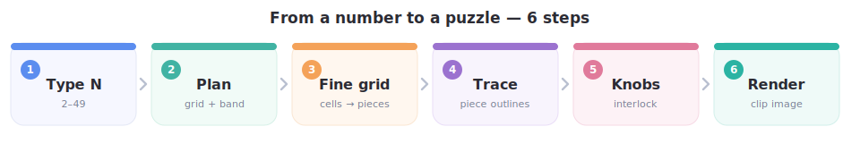
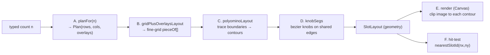
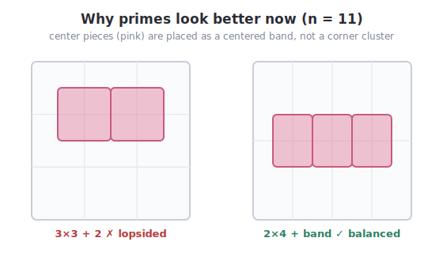
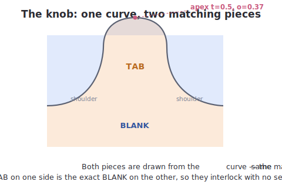
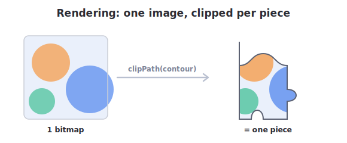

# Algorithms, Math & Rendering

> Companion to [engineering-guide.md](engineering-guide.md). This is the deep dive: the exact
> algorithms, the actual numbers in the code, and how a frame is drawn. Every constant here is the
> real value in `SlotJigsaw.kt` / `SlotLayout.kt` / `SlotPuzzleScreen.kt`.

Pipeline at a glance:





---

## A. Count → plan (`planFor`, `candidate`, `scoreOf`)

`slotLayoutForCount(n)` first clamps `n` to `[MIN_PIECE_COUNT=2, MAX_PIECE_COUNT=49]`, then `planFor`
brute-forces every `rows×cols` with `rows*cols ≤ n` and scores each.

### A.1 `candidate(rows, cols, k)` — where the overlays go

`k = n − rows*cols` is the number of center pieces to add. They are placed as **one contiguous band on
the middle interior row**:

```
row      = rows / 2                       // integer division
startCol = 1 + ((cols - 1) - k) / 2       // integer division
overlays = [ (row, startCol + i)  for i in 0 until k ]
```

Returned as `null` (rejected) when it can't be built:
- `k == 0` → plain grid, `overlays = []` (always valid).
- `rows < 2` → no interior row to host a center piece.
- `cols - 1 < k` → the band wouldn't fit inside one interior row.

`row = rows/2` is the board's **center line** when `rows` is even (e.g. `rows=4 → row=2`, at
`y = 2/4 = 0.5`). `startCol` centers the band: with `cols-1` interior columns and `k` of them used,
it leaves `((cols-1)-k)/2` empty on each side.

### A.2 `scoreOf(plan)` — the cost function (lower = better)

```
aspectExcess   = max(rows,cols) / min(rows,cols) − 1
verticalAsym   = 0 if (k == 0 or rows is even) else 1
horizontalAsym = 0 if (k == 0 or ((cols-1) - k) is even) else 1

score = aspectExcess * 2.5      // prefer near-square
      + verticalAsym   * 3.5    // prefer the band on the exact center line
      + horizontalAsym * 1.5    // prefer a horizontally centered band
      + k              * 0.3    // mild preference for fewer overlays
```

`verticalAsym` has the heaviest weight (3.5): a band on an off-center row is the worst-looking case
(that was the old lopsided 11). `horizontalAsym` triggers when `(cols-1)-k` is odd — the band can't be
perfectly centered and sits half a cell off.

### A.3 Worked examples (the real chosen plans)

Each row shows the winning candidate and its score arithmetic.

| n | Winner | aspectExcess·2.5 | vert·3.5 | horiz·1.5 | k·0.3 | **score** | runner-up |
|---|---|---|---|---|---|---|---|
| 5 | 2×2 + (1,1) | 0 | 0 | 0 | 0.3 | **0.30** | 1×5 grid (10.0) |
| 7 | 2×3 + (1,1) | 1.25 | 0 | 1.5 | 0.3 | **3.05** | 3×2 + 1 (5.05) |
| 9 | 3×3 grid | 0 | 0 | 0 | 0 | **0.00** | 1×9 (20.0) |
| 11 | 2×4 + (1,1),(1,2),(1,3) | 2.5 | 0 | 0 | 0.9 | **3.40** | 3×3 + 2 (4.10) |
| 13 | 4×3 + (2,1) | 0.83 | 0 | 1.5 | 0.3 | **2.63** | 3×4 + 1 (4.63) |



Reading two of them:

- **11** picks `2×4 + 3` (a centered band across the middle, symmetric both ways) over the squarer
  `3×3 + 2`, because `3×3` has odd rows → `verticalAsym = 1 → +3.5`, which outweighs `2×4`'s
  aspect penalty (`+2.5`). That's exactly the lopsided-cluster fix.
- **7** is the one count that can't be made symmetric: `2×3` has even rows (vertically centered, good)
  but `(cols-1)-k = (2)-1 = 1` is odd → `horizontalAsym = +1.5`. One piece simply can't be centered in
  an even-width row. The score accepts it as the least-bad option.

---

## B. Plan → fine grid (`gridPlusOverlaysLayout`)

A "2×2 + center" isn't a grid, so we work on a **2× finer** cell grid where it becomes a clean
polyomino assignment.

```
fineR = 2 * baseRows
fineC = 2 * baseCols
pieceOf[fr][fc] = (fr/2) * baseCols + (fc/2)         // base piece id, row-major
```

Each overlay `k` at base vertex `(vr, vc)` gets a fresh id `baseRows*baseCols + k` and **steals the
2×2 fine block straddling that vertex** — one corner cell from each of its four base neighbours:

```
cells stolen by overlay (vr,vc):
  (2vr-1, 2vc-1)  (2vr-1, 2vc)
  (2vr,   2vc-1)  (2vr,   2vc)
```

### Worked example: `centerFiveLayout()` (base 2×2, overlay at (1,1))


`fineR = fineC = 4`. Base ids `0..3`; overlay id `4` steals fine cells `(1,1),(1,2),(2,1),(2,2)`:

```
 0 0 1 1
 0 4 4 1      ← 0,1,2,3 are the four corner L-trominoes; 4 is the center
 2 4 4 3
 2 2 3 3
```

### Worked example: `n = 11` (base 2×4, overlays at (1,1),(1,2),(1,3))

`fineR = 4, fineC = 8`. Base ids `0..7`; overlay ids `8,9,10` form a band across the middle:

```
 0 0 1 1 2 2 3 3
 0 8 8 9 9 10 10 3
 4 8 8 9 9 10 10 7
 4 4 5 5 6 6 7 7
```

### Why a single-row band never breaks a piece

Overlay `(vr,vc)` steals exactly **one** fine cell from each of its four base cells
`(vr-1,vc-1), (vr-1,vc), (vr,vc-1), (vr,vc)`. With overlays confined to **one interior row**, any base
cell borders at most two of them, and those two steal cells on the **same edge** of the base cell
(horizontally adjacent) — leaving an L/domino, which is still connected. So no base piece can ever be
split into two, which is what guarantees the boundary tracer (next section) always succeeds. The test
`anyTypedCountBuildsExactlyThatManyPieces` checks this for all 2–49.

---

## C. Fine grid → contours (`polyominoLayout` / `buildSlot`)

For each piece id, trace its outline as a closed loop of unit cell-edges, then decorate the shared
ones with knobs.

### C.1 Collect boundary half-edges (clockwise, interior on the right)

For every cell `(r,c)` belonging to the piece, look at its 4 sides; a side is on the boundary when the
neighbour across it is a **different** piece (or off-grid). Emit it as a directed edge, walking the
cell clockwise, with the outward normal recorded:

| side | from → to (vertex coords) | outward normal | neighbour |
|---|---|---|---|
| top | `(c,r) → (c+1,r)` | `(0,−1)` | `(r−1, c)` |
| right | `(c+1,r) → (c+1,r+1)` | `(1,0)` | `(r, c+1)` |
| bottom | `(c+1,r+1) → (c,r+1)` | `(0,1)` | `(r+1, c)` |
| left | `(c,r+1) → (c,r)` | `(−1,0)` | `(r, c−1)` |

Vertex `(i,j)` maps to board space as `(i / cols, j / rows)`.

### C.2 Chain into one loop

```
byStart = edges keyed by their start vertex
cur = edges.first(); startVertex = cur.start
repeat:
    ordered += cur
    cur = byStart[cur.end]            // the edge that begins where this one ends
until cur.start == startVertex
check(ordered.size == edges.size)     // must consume every edge = one simple loop
```

The `check` is the safety net: a disconnected piece would produce two loops, `ordered` would be
shorter, and construction throws — caught by tests, never shipped.

### C.3 Emit segments

Walking `ordered`, each edge becomes either:
- **border** (`other < 0`) → a single `Seg.Line` to the end vertex (flat), or
- **shared** (`other ≥ 0`) → a jigsaw knob (`knobSegs`, section D).

The contour's `start` is the first vertex; `bounds` is the bbox of the piece's cells; `anchor` is the
**centroid of the cell centres** (this is what `nearestSlotId` compares against).

---

## D. Knob geometry (`knobSegs`) — the bezier math

A shared edge from `S=(sx,sy)` to `E=(ex,ey)`, outward unit normal `n=(nx,ny)`, is drawn as a classic
puzzle knob: flat shoulder → pinched neck → round bulb → neck → shoulder.



### D.1 The control points

The knob is described in **(t, o)** coordinates: `t` is the fraction along the edge, `o` the outward
offset. They map to board space via:

```
L    = |E − S|                          // edge length
d    = E − S
sign = +1 for TAB, −1 for BLANK
pt(t, o) = ( sx + d.x*t + nx*(o * sign * L),
             sy + d.y*t + ny*(o * sign * L) )
```

Note `o` is multiplied by `L`, so the knob scales with edge length (it stays proportional on a fine
grid). The exact sequence (one `Line`, four `Cubic`s, one `Line`):

| step | type | control 1 (t,o) | control 2 (t,o) | end (t,o) |
|---|---|---|---|---|
| 1 | Line | — | — | (0.40, 0) |
| 2 | Cubic | (0.42, 0.10) | (0.32, 0.12) | (0.32, 0.22) |
| 3 | Cubic | (0.32, 0.32) | (0.42, 0.37) | (0.50, 0.37) |
| 4 | Cubic | (0.58, 0.37) | (0.68, 0.32) | (0.68, 0.22) |
| 5 | Cubic | (0.68, 0.12) | (0.58, 0.10) | (0.60, 0) |
| 6 | Line | — | — | (1.00, 0) |

So the bulb apex is at `t=0.50, o=0.37` (peak height `0.37·L` out of the edge); the neck pinches near
`t=0.40` and `t=0.60` (back to `o=0`). The control points at `t<neck` / `t>neck` give the bulb its
overhanging, interlocking shoulders.

```
        ___
       /   \          o (outward) ↑
   ___/     \___      apex at t=0.5, o=0.37
  S            E      flat shoulders at the ends
```

### D.2 TAB vs BLANK is decided by the seed, per piece

```
horizontal edge: bulbPositive = (seedBit == 1)    // bulb toward +y
                 outwardPositive = (n.y > 0)
                 tab = (outwardPositive == bulbPositive)
vertical edge:   same with the x axis
```

The two pieces sharing an edge have **opposite** outward normals, so one computes `tab = true` and the
other `tab = false` — automatically complementary.

### D.3 Why the two halves are pixel-identical (complementarity proof)

Piece A walks `S→E` with normal `nA`, `signA`; piece B walks `E→S` with `nB = −nA`,
`signB = −signA`. B's point at parameter `t`:

```
ptB(t) = E + (−d)·t + (−nA)·(o · (−signA) · L)
       = E − d·t + nA·(o · signA · L)
```

A's point at parameter `1−t`:

```
ptA(1−t) = S + d·(1−t) + nA·(o · signA · L)
         = (S + d) − d·t + nA·(o · signA · L)
         = E − d·t + nA·(o · signA · L)      // since S + d = E
```

So `ptB(t) = ptA(1−t)` — the same curve traversed backwards. And the `(t,o)` table is symmetric under
`t ↔ 1−t` (0.40↔0.60, 0.42↔0.58, 0.32↔0.68, 0.50↔0.50; the `o` values mirror), so the reversed cubic
sequence reproduces the identical silhouette. ∎ The pieces interlock with no seam.

### D.4 The seed (`seedBit`)

Deterministic 0/1 per unit edge (so the same edge always knobs the same way, stable per `seed`):

```
h = seed
h = h*1_000_003 + (horizontal ? 1 : 0)
h = h*1_000_003 + i
h = h*1_000_003 + j
h = h xor (h >>> 31)
h = h * (−0x61c8864680b583eb)     // 64-bit avalanche (golden-ratio constant)
return (h >>> 33) & 1
```

`1_000_003` is a small prime mixer; the final multiply + shift is an avalanche so neighbouring edges
get uncorrelated bits.

---

## E. Rendering a frame (`SlotPuzzleBoard`)

One `Canvas`. Let `s = size.minDimension` (the board is square via `aspectRatio(1f)`).

### E.1 The transform

```kotlin
if (image != null) drawBoardImage(image, s, s, alpha = 0.12f)   // faint whole-image preview
withTransform({ scale(s, s, pivot = Offset.Zero) }) {
    // now 1 board-unit == s pixels; everything below is in [0,1] space
}
```

### E.2 One bitmap, N clips (the image-fragment trick)



Each placed slot draws the **whole** image, clipped to its contour:

```kotlin
clipPath(contourPath) {
    drawImage(image, srcOffset, srcSize,            // src = centered square crop
              dstOffset = IntOffset.Zero,
              dstSize  = IntSize(1, 1),             // 1 board-unit → s px under the transform
              alpha = a)
}
```

`dstSize = (1,1)` looks odd but is exact: under `scale(s)` the 1×1 board-unit rectangle becomes the
full `s×s` board, so the source image fills `[0,1]²` and the `clipPath` keeps only this slot's region.
No per-piece bitmap, no per-piece decode — one image, N clips.

**Square crop** (`slotSquareCrop`) so non-square photos don't distort:
```
side   = min(imageW, imageH)
offset = ((imageW − side)/2, (imageH − side)/2)
```
(The trade-off: edges of a very wide/tall photo are cropped.)

### E.3 Placement animation (draw-phase only)

Each newly placed slot gets an `Animatable(0f → 1f)` over `PLACE_DURATION_MS = 350` (`tween`). The
draw lambda reads `a = anim.value`, so only the **draw phase** re-runs each frame — the composition
never recomposes during the animation. `FADE_AND_POP` adds a scale:

```
pop = 0.9 + a * 0.1            // 0.9 → 1.0 as it fades in
// applied as scale(pop, pop) pivoted at the slot's bounds centre
```

### E.4 The other draw constants (all in board units; ×s for pixels)

| what | value |
|---|---|
| faint whole-image preview | alpha `0.12` |
| empty-slot ghost stroke | width `0.012` |
| target-slot highlight | fill alpha `0.12`, stroke `0.012 × 1.4` |
| placed-slot white outline | width `0.008`, alpha `0.7 × a` |

### E.5 Tray thumbnail framing (`SlotPieceImage`)

A tray item draws one slot zoomed to fill its box. With the slot's `bounds` (`b`):

```
scale = canvas.minDimension * 0.86 / max(b.width, b.height)   // 0.86 leaves a margin
ox    = (canvas.width  − b.width  * scale) / 2 − b.left * scale
oy    = (canvas.height − b.height * scale) / 2 − b.top  * scale
// translate(ox,oy) then scale(scale); draw the same clipped fragment
```

The `ox/oy` centre the slot's bounding box in the thumbnail; `elevated` (while dragging) adds a
piece-shaped shadow offset `translate(0.02, 0.03)` at alpha `0.28`.

---

## F. Hit-testing & drag math

### F.1 Tap → slot

The board reports the tap in normalized coords; the layout returns the nearest anchor by **squared
distance** (no sqrt needed):

```
onTapNorm(nx, ny) = (offset.x / size.width, offset.y / size.height)
nearestSlotId(x, y) = argmin over slots of  (anchor.x − x)² + (anchor.y − y)²
```

If a tray piece is selected, the tap becomes `PlaceSelectedAt(nx, ny)`.

### F.2 Drag → slot

The finger is tracked in **root** pixels; on release it's converted to normalized board coords using
the board's `boundsInRoot()`:

```
nx = (dragPos.x − boardRect.left) / boardRect.width
ny = (dragPos.y − boardRect.top)  / boardRect.height   → PlacePieceAt(id, nx, ny)
```

In both cases the ViewModel re-resolves `nearestSlotId` and only accepts the drop if it equals the
piece's own id; otherwise it emits `WrongPlacement` and the piece stays in the tray.

---

## G. End-to-end with numbers: `n = 5`

1. **Plan** — `planFor(5)` → `Plan(2, 2, [(1,1)])` (score 0.30).
2. **Fine grid** — `gridPlusOverlaysLayout(2,2,[(1,1)])` → the 4×4 assignment in §B.
3. **Contours** — `polyominoLayout` traces 5 loops. Corner piece 0 (no knobs shown):
   `(0,0)→(0.5,0)→(0.5,0.25)→(0.25,0.25)→(0.25,0.5)→(0,0.5)→close`, with knobs on the three interior
   edges (right, the two notch edges, bottom) and flat top/left (board border).
4. **Anchors** (centroids of cell centres):
   - piece 0 (cells (0,0),(0,1),(1,0)) → `(0.208, 0.208)`
   - piece 4 (cells (1,1),(1,2),(2,1),(2,2)) → `(0.500, 0.500)`
5. **Render** at a 1000 px board: `scale(1000)`; ghost strokes ≈ `0.012 × 1000 = 12 px`; placed pieces
   fade/pop over 350 ms; the center piece's image fragment is the central `(0.25..0.75)²` region of
   the square-cropped photo.
6. **Hit-test** — a drop at normalized `(0.5, 0.5)` → `nearestSlotId` → `4` (center). A drop at
   `(0.1, 0.1)` → `0` (top-left).

---

### See also

- [engineering-guide.md](engineering-guide.md) — architecture, classes, flows.
- Source of truth: `feature/puzzle/domain/slot/SlotJigsaw.kt`,
  `feature/puzzle/domain/slot/SlotLayout.kt`, `feature/puzzle/ui/SlotPuzzleScreen.kt`.
