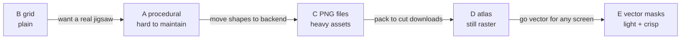
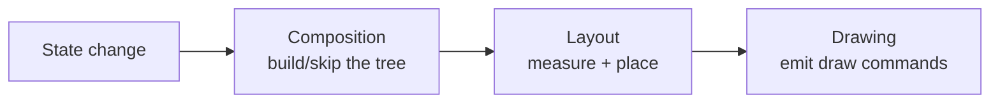

# Client-Side Puzzle Rendering — Full Comparison & Decision Guide

> **Scope.** A deep, **client-focused** analysis of every way to produce and render the puzzle, for a
> **Compose Multiplatform** app shipping on **Android *and* iOS** across a wide range of **devices,
> screen sizes, and densities**. It explains *how each approach actually draws on the GPU*, what it
> costs in CPU/GPU/memory, how it behaves on low-end hardware and large screens, the problems of each,
> and concrete client-side mitigations. Backend concerns are mentioned only where they change what the
> client must do.
>
> This document does not change any code. It is the decision package.

## Contents

- [0. TL;DR & recommendation](#0-tldr--recommendation)
- [The problem, felt — three users and one campaign](#the-problem-felt--three-users-and-one-campaign)
- [How the solutions evolved (the short story)](#how-the-solutions-evolved-the-short-story)
- [1. What the client must do (independent of approach)](#1-what-the-client-must-do-independent-of-approach)
- [2. The client cost model](#2-the-client-cost-model)
- [3. The five approaches, in depth](#3-the-five-approaches-in-depth)
- [4. Multi-device & multi-size (the hard part)](#4-multi-device--multi-size-the-hard-part)
- [5. Comparison matrices](#5-comparison-matrices)
- [6. Worked budgets for target devices](#6-worked-budgets-for-target-devices)
- [7. Client-side mitigations catalog](#7-client-side-mitigations-catalog)
- [8. Decision tree](#8-decision-tree)
- [Recommendations by situation](#recommendations-by-situation)
- [Traps & lessons (worked examples)](#traps--lessons-worked-examples)
- [9. Appendix: Compose/Skia primitives & glossary](#9-appendix-composeskia-primitives--glossary)

---

## 0. TL;DR & recommendation

There are **five** ways to render the puzzle on the client:

| | Approach | Piece shape source | Client draw primitive |
|---|---|---|---|
| **A** | Procedural jigsaw (current `SlotJigsaw`) | math (bezier knobs) | `clipPath` + `drawImage` |
| **B** | Rectangular grid (legacy) | rectangles | `drawImage` sub-rect |
| **C** | Backend pre-cut PNGs — individual files | raster PNG | `drawImage` sprite |
| **D** | Backend pre-cut PNGs — sprite atlas | raster PNG (packed) | `drawImage` sub-rect |
| **E** | Backend vector masks + 1 image | vector polygons | `clipPath` + `drawImage` |

**The fundamental trade is render-cost vs asset-weight vs device-scaling vs maintainability — no single
option wins all four.** In one sentence each:

- **A** — most flexible & resolution-free, but the hardest to maintain and the heaviest to render.
- **B** — cheapest and most robust everywhere, but looks like a grid, not a jigsaw.
- **C** — full art control & cheap render, but the worst memory/bandwidth/density profile on low-end Android.
- **D** — like C but one packed image; better memory/bandwidth, limited by GPU max-texture on old devices.
- **E** — backend controls shapes, assets stay tiny and **resolution-independent**, client stays simple; cost is the same clip render as A (mitigable).

**Recommendation for this fleet** (telco-scale Android fragmentation + iOS, team wants maintainability):
- If a plain look is acceptable → **B**.
- If you want real shaped pieces, are committed to a backend pipeline, and will manage assets → **D** (atlas), *not* C.
- The best all-round balance — maintainable client, light & **density-proof** assets, scales across every screen size — is **E (vector masks)**. It deserves to be on the table next to the PNG plan, especially if **user-supplied photos / arbitrary counts** remain a requirement (E needs the backend to compute only *polygons*, not render raster pieces per image).

The rest of this document is the evidence for those statements.

---

## The problem, felt — three users and one campaign

Numbers are abstract; users aren't. Picture **one campaign** — "Complete the puzzle, win 10 GB" — a
**16-piece** puzzle of a branded summer image (and later, a variant cut from the *user's own selfie*).
Now picture three real people opening it:

- **Amina** — a ₦25,000 Android Go phone: **2 GB RAM**, a low-end Mali GPU (max texture **2048**), a
  patchy mobile connection. **She is the telco's biggest segment** — most of the audience looks like
  Amina, not like the people who built the app.
- **Joon** — a mid Pixel: 6 GB RAM, fast GPU, good 4G. Comfortable.
- **Sara** — an iPhone 13: 6 GB, A15, Wi-Fi. The phone the product manager demos on.

Here is what each person *experiences*, per approach — the same campaign, very different days:

| | **Amina** (entry Android, slow net) | **Sara** (iPhone, Wi-Fi) |
|---|---|---|
| **A** procedural | Loads instantly (one image). Smooth — until she drops the **last** piece: the board re-clips all 16 at once and **stutters ~⅓ s**. Crisp even if she reopens it on a friend's tablet. | Buttery throughout. |
| **B** grid | Instant, smooth, flawless — but it looks like a **spreadsheet**, and marketing hates it. | Same: fine, but plain. |
| **C** PNG files | Opens → **16 downloads** over flaky data (~3 MB, 16 round-trips) → **spinner for ~8 s**, one piece occasionally fails and shows **blank**. The 16 decodes briefly **freeze the UI**; if her selfie wasn't downsampled, the app is **killed** in the background. On a tablet the pieces look **soft**. | Fast Wi-Fi, lots of RAM → looks great. *This is the trap: perfect in the demo, broken for the majority.* |
| **D** atlas | **One** download (~1.5 MB), one decode → much better. But the crisp 2048² atlas is **right at her GPU's limit**; a higher-res tablet variant must be tiled. | Great. |
| **E** vector masks | One image (~300 KB) + a few KB of shapes → **fast load**, crisp on her phone *and* a tablet, ~5 MB RAM. Only cost: the same ⅓ s clip redraw on the last piece (fixable). | Great. |

The lesson the table screams: **the decision is made by Amina, not Sara.** Anything that feels fine on
the PM's iPhone can still be the wrong choice if it punishes the entry-Android majority.

---

## How the solutions evolved (the short story)

Each approach was a reasonable answer to the *previous* approach's pain. Reading them as a journey
makes the trade-offs click:

1. **"Just slice it into a grid." (B)** The obvious start: cut the image into rectangles, blit each.
   Runs on everything, costs nothing. → *Reaction: "that's not a puzzle, it's a checkerboard."*
2. **"Make it a real jigsaw — in code." (A)** Generate knobbed shapes procedurally, clip the image to
   each. Gorgeous, one image, crisp at any size, any piece count. → *Reaction: "only one engineer
   understands the bezier/boundary math, and it taxes cheap GPUs."*
3. **"Let the backend make the pieces." (C)** Ship pre-cut transparent PNGs; the client just places
   them. Dumb client, full art control. → *Reaction: "now the phone carries N images — slow downloads,
   big memory, and they blur on large screens."*
4. **"Pack them into one sheet." (D)** An atlas fixes the download count and decode cost. → *Reaction:
   "better, but still raster — we need density variants, and old GPUs cap the texture size."*
5. **"Keep backend control, but go vector." (E)** Backend sends one image + polygon shapes; the client
   clips. Light, crisp everywhere, the look lives in data the backend owns — paying only the clip
   render cost from step 2 (and that's cacheable).



No step is strictly "best" — each **trades one problem for another**. The whole point of this document
is to match the trade to *your* fleet (which, remember, looks like Amina).

---

## 1. What the client must do (independent of approach)

Whatever the geometry source, the client's job is the same loop:

1. **Empty board** — show a faint preview / per-slot ghost so the player sees the target.
2. **Tray** — show the unplaced pieces.
3. **Place** — tap-to-place or drag-and-drop; on drop, snap to the nearest slot.
4. **Animate** — fade/pop a piece in when it lands.
5. **Complete** — celebrate + reward.

Only **steps 1, 2, 4** differ between approaches (how a piece is *drawn*). Steps 3 and 5 (hit-testing
by nearest anchor, completion, events) are **identical for all five** — which is why the existing
`SlotPuzzleViewModel` survives every option unchanged.

### 1.1 The three Compose phases (why this matters for cost)

Compose renders in three phases per frame:



- Reading a state value **in composition** → recompose + layout + draw (most expensive).
- Reading it **in layout** → layout + draw.
- Reading it **in the draw lambda** → **draw only** (cheapest).

The board animates by reading a per-piece `Animatable` **inside the draw lambda**, so a placement
animation re-runs only the **draw** phase — no recomposition. This is the single most important perf
lever and it applies to every approach. The corollary: **a `Canvas` only redraws when a state it reads
changes. Idle = zero work.** Costs below are therefore "**per redraw**," and redraws happen mainly
during the ~350 ms placement animation and during drag.

### 1.2 Coordinate spaces

Three spaces, same for all approaches:

| Space | Range | Owner |
|---|---|---|
| Normalized board | `[0,1]²` | data (slot positions, anchors) |
| Board pixels | `0..boardPx` | the board `Canvas` (`scale(boardPx)`) |
| Root pixels | whole screen | drag tracking |

Keeping geometry **normalized** is what makes every approach resolution-independent at the *data*
level; whether the *pixels* are resolution-independent depends on the approach (vector vs raster).

---

## 2. The client cost model

To compare fairly, reason about four costs. Numbers below assume an **RGBA_8888** bitmap (4 bytes/px)
and a **1080×1080 board** (a typical phone) unless stated.

> Board pixels: `1080 × 1080 = 1,166,400 px`.
> One full board bitmap: `1,166,400 × 4 B ≈ 4.67 MB`.

### 2.1 CPU — build + decode

- **Build** (geometry generation): only A/B/E compute anything; all are `O(n)`–`O(n²)` in *piece
  count* and run **once per layout**, in microseconds for realistic `n`. Negligible everywhere.
- **Decode** (turning compressed bytes into pixels): proportional to **decoded pixels**, on CPU (or
  hardware decoder). One image = one decode. **N images = N decodes** (C) → slower first paint on weak
  CPUs. **This is where C hurts at startup.**

### 2.2 GPU — draw calls, fill-rate, overdraw, clip masks

The GPU cost of a frame is dominated by two things:

1. **Fill-rate / overdraw** — total pixels written, counted *with* repetition. Drawing the full board
   image `K` times = `K × board_px` of fill = **`K×` overdraw**. Low-end GPUs are fill-rate bound, so
   overdraw is the #1 enemy.
2. **Clip masks** — `clipPath` with a bezier/polygon path makes Skia compute an (anti-aliased)
   coverage mask before drawing. Many small AA clips are disproportionately slow on tiled mobile GPUs.

Per-approach **overdraw during one placement animation** (with `K` already-placed pieces in the board
`Canvas`):

| Approach | What each placed piece draws | Overdraw | Clip masks/frame |
|---|---|---|---|
| A (as built) | the **whole** image, clipped | up to `K×` | `K` bezier clips |
| A (optimized*) | only its sub-rect, clipped | ~`1×` | `1` clip (animating piece) |
| B | only its rectangle | ~`1×` | 0 |
| C / D | its sprite (frame bbox, overhang) | ~`1.3–2×` | 0 |
| E | the whole (or sub-rect) image, clipped | `K×` (or `1×*`) | `K` polygon clips |

`*` with the layer-cache + bounding-region mitigations in §7.

**Worked number:** a near-complete 16-piece board at 1080², approach A *as built*, redraws ~16 ×
1.17 Mpx ≈ **18.7 Mpx per frame**. At 60 fps that's **~1.12 Gpx/s of fill plus 16 AA clips** — right
at the edge of what a weak GPU sustains, for the 350 ms the last piece animates. B/C/D at ~1–2× are
**~1.2–2.3 Mpx/frame** — trivial. This is the quantified reason A/E are the render risks and why the
mitigations in §7 matter for them.

### 2.3 Memory — where the pixels live

Decoded bitmap size = `width × height × bytesPerPixel`. Examples:

| Bitmap | Pixels | RGBA_8888 |
|---|---|---|
| 1024² | 1.05 M | 4.19 MB |
| 1080² (board) | 1.17 M | 4.67 MB |
| 2048² (atlas) | 4.19 M | **16.78 MB** |
| 4000×3000 (12 MP **gallery photo**) | 12 M | **48 MB** |

Per-approach resident memory at a 1080² board:

| Approach | Resident bitmaps | ≈ MB |
|---|---|---|
| A | 1 source + N tiny paths | ~4.7 |
| B | 1 source | ~4.7 |
| C | **N piece bitmaps** (each padded by tab overhang) — total ≈ `~2 × board_px` | **~9–10** |
| D | 1 atlas (sized to fit pieces, ≤ GPU max) | **~9–17** |
| E | 1 source + N polygon paths | ~4.7 |

Two memory gotchas, both **client-side**:

- **The gallery-photo trap (all approaches that accept a device image):** decoding a raw 12 MP photo
  is **48 MB**, a 48 MP photo is ~**190 MB** — instant OOM territory on a 2 GB phone. You **must**
  downsample to ~board resolution on decode (`inSampleSize` / a loader's target size). This is the
  single biggest client memory risk and is independent of the rendering approach.
- **Where bitmaps live:** on Android, *hardware bitmaps* (API 28+) keep pixels in GPU/native memory,
  off the Java heap, reducing GC pressure; on iOS, decoded images live in native memory under jetsam
  accounting. Either way, **N separate bitmaps (C) is the worst pattern** for low-RAM devices.

### 2.4 Recomposition vs redraw (Compose stability)

For the **C/D** approaches you may render pieces as individual `Image` composables rather than one
`Canvas`. Then Compose can **skip** recomposing/redrawing the pieces that didn't change — only the
newly placed one updates. That's a real advantage *if* state is **stable** (`@Immutable` state,
`ImmutableList`/`ImmutableSet`, hoisted lambdas) so Compose's skipping kicks in. For **A/B/E** the
board is one `Canvas`, so it's all-or-nothing per redraw (mitigated by drawing in the draw phase and
caching placed pieces in a layer — §7).

---

## 3. The five approaches, in depth

Each section: **how it draws**, **costs**, **density behavior**, **low-end behavior**, **problems**.

### A. Procedural jigsaw (current `SlotJigsaw`)

**How it draws.** The client generates each piece's outline as a bezier `Contour` (knobs computed in
Kotlin), then for each placed piece: `clipPath(contour) { drawImage(sourceImage) }` inside one
`Canvas`. The empty board draws ghost strokes of the contours.

**Costs.**
- CPU build: `O(n²)`, once, <1 ms. Negligible.
- GPU: **highest** — `clipPath` per placed piece + (as written) full-image overdraw → up to `K×`
  per redraw, plus `K` AA bezier clips. See §2.2.
- Memory: **lowest** — one source bitmap + tiny path objects (~4.7 MB).
- Decode: one image.

**Density / size.** **Excellent.** Vector geometry is re-rasterized at the device's exact pixels →
crisp on a 5″ phone and a 13″ tablet from the *same* data, no extra assets, flat memory across all
densities. This is procedural rendering's superpower.

**Low-end.** Render is the risk: clip + overdraw can jank during large-N / bursty animations on weak
GPUs. Idle is free. Mitigations (§7) bring it back in line but add code.

**Problems.** Maintainability (specialized math few engineers can edit — the team's stated reason);
geometry fragility (new shapes can break the boundary tracer); one visual style; no per-piece raster
art.

### B. Rectangular grid (legacy)

**How it draws.** Each piece is a rectangle; `drawImage(srcOffset, srcSize, dstOffset, dstSize)` copies
that sub-rect of the source to the board. No clip, no shapes.

**Costs.**
- CPU build: trivial. GPU: **lowest** — `~1×` overdraw, zero clips. Memory: one source (~4.7 MB).
- Decode: one image.

**Density / size.** **Excellent** — sub-rects of the source scale crisply; one asset for all devices.

**Low-end.** **Best in class.** Plain blits; runs on the weakest hardware.

**Problems.** Looks like a grid, not a jigsaw — marketing/product may reject it. No center/irregular
pieces. (Everything else is ideal.)

### C. Backend pre-cut PNGs — individual files

**How it draws.** Backend cuts the image into **N transparent PNGs** (shape baked into alpha), each
with a `frame` (board-space draw box, including tab overhang). Client downloads each, then draws it as
a sprite at its frame — `drawImage` of a small bitmap, or an `Image` composable. No clip, no geometry.

**Costs.**
- CPU build: none on client; **N decodes** (startup latency on weak CPUs).
- GPU: **low** — sprite blits, `~1.3–2×` overdraw from tab overlap. No clips.
- Memory: **worst** — N bitmaps, ~9–10 MB at board res, growing with N and overhang padding.
- Network: **N downloads** (latency + bandwidth) → needs caching, progressive load, retry.

**Density / size.** **Poor.** Raster pieces are fixed-resolution. To stay crisp on tablets/high-DPI you
must ship **density buckets** (@1x/@2x/@3x) or a hi-res master → more assets, more bandwidth, more
memory to manage. (Android density spread ~120–640 dpi is the pain; iOS is just @2x/@3x.)

**Low-end.** Render is cheap, but **N-bitmap memory + N decodes** stress low-RAM Android (OOM risk) and
slow first paint.

**Problems.** Memory/bandwidth/decode all scale with N; density variants; requires a backend cutting
pipeline; weak offline/first-load (needs all assets before play).

### D. Backend pre-cut PNGs — sprite atlas

**How it draws.** Same pre-cut pieces, but **packed into one image** + per-piece source rects. Client
decodes **one** atlas and blits sub-rects (`drawImage(srcOffset, srcSize, …)`), shaped by the packed
alpha.

**Costs.**
- CPU build: none; **one** decode.
- GPU: **low** — sub-rect blits, `~1.3–2×` overdraw. No clips.
- Memory: **one atlas** (e.g. 1536² ≈ 9.4 MB, 2048² ≈ 16.8 MB) — a single allocation, more efficient
  than N separate bitmaps but still raster-heavy.
- Network: **one download** — best bandwidth of the raster options.

**Density / size.** **Poor (same as C)** — raster → needs density variants of the atlas.

**Low-end.** Better than C (1 decode, 1 texture, no GC churn) **but** bounded by **GPU max texture
size**: many old Android GPUs cap at **2048**, so a high-res/large-N atlas may not upload as a single
texture → must tile into multiple atlases. iOS caps are higher (8192+).

**Problems.** Atlas size limit on old GPUs; backend packing complexity; density variants; one big
allocation.

### E. Backend vector masks + one image

**How it draws.** Backend sends **one full image** + a small JSON of **vector polygons/paths** (the
piece shapes) + anchors. Client clips the single image to each polygon — `clipPath(polygon) {
drawImage(sourceImage) }` — i.e. the *same render family as A*, but the **shapes come from data**, not
from client math.

**Costs.**
- CPU build: parse polygons (cheap). Decode: one image.
- GPU: **same as A** — `clipPath` per placed piece + overdraw (mitigable, §7).
- Memory: **lowest** (with A) — one source + polygon paths (~4.7 MB).
- Network: **one image + a few KB of JSON** — as light as it gets.

**Density / size.** **Excellent** — vector clips re-rasterize at device pixels → one asset set, crisp
on every screen, flat memory. **No density buckets ever.**

**Low-end.** Same clip-render cost as A (the one downside), but **far lighter on memory, bandwidth, and
density** than C/D. Mitigable with layer caching + bounding-region draws.

**Problems.** Keeps `clipPath` render cost; anti-aliased seams between adjacent clipped pieces (backend
must emit a shared cut line); shapes only (no per-piece raster textures/bevels — those need PNGs).

---

## 4. Multi-device & multi-size (the hard part)

This is where the choice really bites, because the fleet is huge. **Both platforms render through Skia
under Compose Multiplatform** (Android via HWUI/Skia on the RenderThread; iOS via Skiko → Metal), so a
given draw command produces **identical pixels on both** — *visual parity is automatic for all five
approaches.* The differences are in **scaling, memory, and decode**, and they hit **Android far harder
than iOS** because of fragmentation.

### 4.1 Density (dp vs px)

Compose lays out in **dp**; images are **px**. A drawable authored at 1080 px drawn into a 1080 px
board is 1:1. On a denser screen the board is *more* px, so:

- **Vector/procedural (A, B, E):** re-rasterized at the real pixel count → **always crisp**, from one
  asset. Memory is constant across densities.
- **Raster (C, D):** a piece cut at phone resolution is **upscaled → soft** on a tablet/high-DPI
  screen; a tablet-res asset is **wasted memory** on a small phone. Mitigation = **density buckets**
  (`@1x/@2x/@3x`) or a hi-res master + downsample → more assets, bandwidth, and memory bookkeeping.
  Android densities span ~120–640 dpi (6 buckets); iOS is just @2x/@3x.

### 4.2 Screen sizes & aspect (phone / tablet / foldable)

- The board should size to the **smaller screen dimension** and use the backend's `boardAspect`. Slot
  positions are normalized, so layout itself is size-independent for all approaches.
- **Raster (C/D)** also needs enough source resolution for the *largest* board it will appear on (a
  tablet), which again pushes assets bigger → more memory on the devices that can least afford it
  unless you fetch a per-size variant.
- **Vector (A/B/E)** just rasterizes bigger — no asset change.

### 4.3 GPU max texture size

`GL_MAX_TEXTURE_SIZE` (Android GLES) / Metal max texture:

| Tier | Typical max texture |
|---|---|
| Old / low-end Android (GLES2/early3) | **2048** (some 4096) |
| Modern Android | 4096–8192 |
| iOS (A-series) | 8192–16384 |

Implication: an **atlas (D)** or any single bitmap larger than the cap **won't upload as one texture**
on weak Android → it fails or gets downscaled. C/E/B avoid this (small per-piece bitmaps or one
board-sized image). A is fine (board-sized source).

### 4.4 RAM tiers & OOM / jetsam

- Low-end Android (1–2 GB) runs an aggressive low-memory killer; a foreground app has only a few
  hundred MB of headroom. **N piece bitmaps (C)** + an undownsampled photo can blow that.
- iOS terminates (jetsam) on memory spikes; older 2 GB devices (iPhone SE 1, iPad 5) are the constraint.
- **The gallery-photo trap (§2.3)** applies to every approach that accepts a user image: downsample on
  decode or you OOM regardless of how you render.

### 4.5 iOS vs Android — client differences that matter

| Concern | Android | iOS |
|---|---|---|
| Renderer (CMP) | Skia → HWUI (Vulkan/GL) | Skia (Skiko) → Metal |
| Visual parity | identical to iOS | identical to Android |
| Device diversity | **huge** (densities, GPUs, RAM, OEM skins) | narrow, predictable |
| Density variants needed (C/D) | up to 6 buckets | 2 (@2x/@3x) |
| GPU max texture (atlas D) | as low as 2048 | 8192+ |
| Decode / memory model | Bitmap, hardware bitmaps, GC | UIImage/CGImage, jetsam |
| Binary | +Compose | **+~9 MB Compose runtime** (already accepted) |

**Bottom line:** the device/size problem is mostly an **Android** problem, and it specifically
penalizes the **raster** approaches (C, D) with density buckets, atlas-size limits, and N-bitmap RAM.
The **vector** approaches (A, B, E) are intrinsically density- and size-proof.

---

## 5. Comparison matrices

🟢 good · 🟡 ok · 🔴 weak

### 5.1 Efficiency (client)

| Dimension | A | B | C | D | E |
|---|---|---|---|---|---|
| CPU build | 🟡 | 🟢 | 🟢 | 🟢 | 🟢 |
| Decode | 🟢 1 | 🟢 1 | 🔴 N | 🟢 1 | 🟢 1 |
| GPU / overdraw | 🔴 | 🟢 | 🟢 | 🟢 | 🔴 |
| Memory | 🟢 | 🟢 | 🔴 | 🟡 | 🟢 |
| Network | 🟢 | 🟢 | 🔴 | 🟢 | 🟢 |
| Multi-density/size | 🟢 | 🟢 | 🔴 | 🔴 | 🟢 |
| GPU max-texture safety | 🟢 | 🟢 | 🟢 | 🟡 | 🟢 |
| Low-end overall | 🟡 | 🟢 | 🟡 | 🟡 | 🟡 |

### 5.2 Product & maintainability

| Dimension | A | B | C | D | E |
|---|---|---|---|---|---|
| Maintainability (client) | 🔴 | 🟢 | 🟢 | 🟢 | 🟡 |
| Real jigsaw look | 🟢 | 🔴 | 🟢 | 🟢 | 🟢 |
| Per-piece raster art (textures/bevels) | 🔴 | 🔴 | 🟢 | 🟢 | 🔴 |
| User photo / arbitrary count | 🟢 | 🟢 | 🔴* | 🔴* | 🟡* |
| Offline / first-load | 🟢 | 🟢 | 🔴 | 🟡 | 🟢 |
| Backend pipeline needed | none | none | **cut+host rasters** | **cut+pack+host** | **emit polygons** |

`*` needs a backend upload-and-cut service; for E the service only computes polygons (light), for C/D
it must render and host raster pieces per image (heavy).

### 5.3 Risk

| Risk | A | B | C | D | E |
|---|---|---|---|---|---|
| Jank on low-end | clip+overdraw | none | decode/RAM | decode/atlas | clip+overdraw |
| OOM on low-RAM | low | low | **high** | medium | low |
| Soft/blurry on big screens | none | none | **yes** | **yes** | none |
| Hard to evolve | **yes** | no | no | no | medium |

---

## 6. Worked budgets for target devices

Approximate, at a **1080² board, N = 16 pieces**, during one placement animation. "Frame fill" is
overdraw × board pixels (1.17 Mpx). Memory is decoded bitmaps only (add the rest of the app on top).

| Device tier (RAM, GPU max tex) | Approach | Decoded mem | Frame fill (animating) | Verdict |
|---|---|---|---|---|
| **Low Android** (1–2 GB, 2048) | A (as built) | ~4.7 MB | ~16× → ~19 Mpx + 16 clips | 🟡 jank risk late-game |
| | A (optimized) / E | ~4.7 MB | ~1× + 1 clip | 🟢 |
| | B | ~4.7 MB | ~1× | 🟢 |
| | C | ~9–10 MB (16 decodes) | ~2× | 🟡 RAM + slow first paint |
| | D | atlas must be ≤2048 → ~4–9 MB | ~2× | 🟡 cap-bound |
| **Mid Android** (4 GB, 4096–8192) | any | 5–17 MB | within budget | 🟢 |
| **Old iPhone/iPad** (2 GB, 8192) | C | ~9–10 MB | ~2× | 🟡 jetsam if combined w/ big photo |
| | A/B/D/E | 4.7–17 MB | low | 🟢 |
| **Mid iPhone** (4–6 GB, 8192+) | any | — | — | 🟢 |

**Reading it:** every approach is fine on mid/high hardware. The decisions are all made by **low-end
Android**, where (a) **A** needs its render mitigations, (b) **C** is the memory/decode risk, (c) **D**
is bounded by the 2048 texture cap, and (d) **B and E (and optimized A)** are comfortable. Layer on the
**gallery-photo trap** for any user-image flow.

---

## 7. Client-side mitigations catalog

Concrete techniques and which approaches they rescue:

| Mitigation | What it does | Helps |
|---|---|---|
| **Layer-cache placed pieces** (`graphicsLayer` / render to an offscreen `ImageBitmap` once placed) | only the *animating* piece is re-clipped/redrawn; settled pieces composite as a flat texture → overdraw drops from `K×` to ~`1×` | **A, E** |
| **Draw the sub-rect, not the whole image** (`srcOffset/srcSize` of just the piece's region, then clip) | cuts per-piece fill from `board_px` to `~board_px/N` | **A, E** (A is currently un-optimized here) |
| **Downsample on decode** (`inSampleSize` / loader target size = board px) | avoids the 48–190 MB gallery-photo OOM | **all** with user photos |
| **Hardware bitmaps** (Android) / keep textures GPU-side | off-heap pixels, less GC | A, B, C, D, E |
| **Atlas tiling** (split into ≤2048 sheets) | respect old-GPU max texture | **D** |
| **Density-aware fetch** (request @1x/@2x/@3x or a size variant) | crisp without over-allocating | **C, D** |
| **Image loader with mem+disk cache** (Coil 3 KMP or host-provided) | dedup, downsample, cache, retry, progressive | **C, D** |
| **Lazy load + ghost placeholder** | play starts before all assets arrive | **C, D** |
| **Device-tier piece cap** | fewer/larger pieces on low-RAM devices | **C, D** (and A render) |
| **`@Immutable` state + immutable collections** | lets Compose skip unchanged pieces (when pieces are `Image`s) | **C, D** |

Note how the mitigations cluster: **A/E** need *render* mitigations (caching, sub-rect); **C/D** need
*asset* mitigations (downsample, atlas tiling, density fetch, caching). **B** needs almost none.

---

## 8. Decision tree

```mermaid
flowchart TD
    Q1{Is a plain grid look acceptable?}
    Q1 -- yes --> B[B · Rectangular grid\ncheapest, most robust]
    Q1 -- no --> Q2{Must scale crisply across\nmany screen sizes with light assets?}
    Q2 -- yes --> Q3{Need per-piece raster art\n(textures, bevels)?}
    Q3 -- no --> E[E · Vector masks\nmaintainable, density-proof]
    Q3 -- yes --> D[D · Atlas PNGs\nfull art, manage density+atlas size]
    Q2 -- no --> Q4{Team can own the procedural math?}
    Q4 -- no --> D
    Q4 -- yes --> A[A · Procedural\nflexible but hard to maintain]
```

**Avoid C (individual PNGs)** for this fleet: it combines the worst memory, bandwidth, decode, and
density profile on exactly the devices (low-end Android) that drive the decision. If you go raster,
go **D**.

---

## Recommendations by situation

Pick the row that sounds like you; the reasoning is the part that matters.

**1. "Mass-market telco — most users are Amina, fixed branded images, tight timeline."**
→ **B (grid)** if a plain look passes review; otherwise **E (vector masks)**.
*Why:* both are light, crisp on every screen, and OOM-proof on 2 GB phones. E gives the real-jigsaw
look the marketing team wants while keeping the asset a single ~300 KB image the backend fully controls.
Avoid C — the per-piece downloads and memory are exactly Amina's pain.

**2. "Premium brand wants photo-real pieces — bevels, soft shadows, textured edges — on mostly modern phones."**
→ **D (atlas PNGs)** with density variants.
*Why:* only raster can carry baked-in lighting/texture per piece. The atlas keeps it to one download
and one decode; modern GPUs clear the texture-size bar. Budget the density variants and cap piece count
so the atlas stays within 2048 for the older devices still in the mix.

**3. "Users upload their own selfie, any piece count."**
→ **E (vector masks)**, or **A (procedural)** if you keep it.
*Why:* the puzzle is generated per *image*, so a backend that must **raster-cut every user photo** (C/D)
is slow and expensive — a render job per upload, per density. E's backend only computes **polygons**
(tiny, fast); the client clips the user's photo locally. A does the same entirely on-device. Either
keeps "your photo, your puzzle" affordable.

**4. "Smallest possible team — we cannot own graphics code."**
→ **B**, or **D** if you need shapes.
*Why:* both push all geometry out of the app — B into trivial rectangles, D into the design/backend
pipeline. The client is just "blit sprites at positions," which any engineer can maintain. (This is the
instinct behind the managers' "let the backend generate everything" call.)

**5. "We already shipped A and it works."**
→ **Keep A**, apply two render mitigations, don't rewrite.
*Why:* a rewrite is risk for little gain if it already works for your audience. Add the **layer-cache**
and **draw-the-sub-rect** fixes (§7) to kill the last-piece stutter on weak GPUs. Only migrate if
*maintainability* (not performance) is the real blocker — and if so, **E** reuses the most of A.

**The one-line default for this project:** if you must choose blind, **E (vector masks)** is the safest
all-rounder — maintainable, backend-driven, light, and crisp from a 5″ Amina phone to a 13″ tablet —
with **B** as the no-frills fallback and **D** as the upgrade when raster art is non-negotiable.

---

## Traps & lessons (worked examples)

Real ways each path goes wrong, with the fix — so the team recognizes them *before* the bug report.

- **The demo-device trap.** Approach C looks flawless on Sara's iPhone in the sprint review, so it ships.
  Two weeks later, crash and 1-star reviews from the field — all entry Android. *Lesson:* always profile
  on the **cheapest** target (an Amina-class device), not the build machine.
- **The gallery-photo OOM.** A 12 MP selfie decodes to **48 MB** (a 48 MP one to ~190 MB). Loaded
  full-res "just to clip it," the app dies on a 2 GB phone. *Fix:* always **downsample on decode** to
  ~board pixels (`inSampleSize` / loader target size) — applies to *every* approach that takes a user
  image.
- **The blurry-tablet surprise.** Phone-resolution PNGs (C/D) get **upscaled** on a foldable/tablet and
  look soft; QA on phones never caught it. *Fix:* density variants, or use a vector approach (A/B/E)
  that re-rasterizes crisply for free.
- **The 24-round-trip load.** A 24-piece puzzle as individual PNGs (C) = **24 HTTP requests**; on a slow
  link the latency alone (24 × ~100 ms) is 2.4 s *before* any bytes. *Fix:* atlas (D) = one request, or
  vector (E) = one image.
- **The texture-cap blank board.** A high-res 4096² atlas (D) uploads fine in dev, but shows **nothing**
  on an older 2048-cap GPU. *Fix:* keep atlases ≤ 2048 for low-end, or tile them.
- **The last-piece stutter.** Procedural/vector (A/E) redraw *all* placed pieces each animated frame, so
  completing a 30-piece board hitches on a weak GPU. *Fix:* **layer-cache** settled pieces so only the
  animating one re-clips (§7).
- **The maintenance stall.** A "center piece overlaps wrong" ticket on approach A sits unfixed for a
  sprint because one engineer owns the bezier/boundary math. *Lesson:* this is a *people* cost, and it's
  why the team is moving the geometry out of the app.

---

## 9. Appendix: Compose/Skia primitives & glossary

**Primitives used by each approach**

| Primitive | What it does | Used by |
|---|---|---|
| `DrawScope.drawImage(srcOffset, srcSize, dstOffset, dstSize, alpha)` | blit a sub-rect of a bitmap to a dst rect | B, C, D, (A/E fill) |
| `clipPath(path) { … }` | restrict drawing to a path region (AA mask) | A, E |
| `Image` / `Painter` composable | a layout node wrapping a bitmap; skippable by Compose | C, D (optional) |
| `Modifier.graphicsLayer` | render into an offscreen texture (cacheable) | mitigation for A, E |
| `Modifier.drawWithCache` | cache draw objects (paths/brushes) across frames | mitigation for A, E |
| `Animatable` read in draw lambda | animate in the **draw** phase only (no recompose) | all (placement anim) |

**Glossary**

| Term | Meaning |
|---|---|
| Overdraw | pixels written more than once per frame; the main low-end GPU cost |
| Fill-rate | how many pixels/second the GPU can write |
| Clip mask | the coverage region Skia computes for `clipPath` (AA = pricier) |
| Density bucket | a resolution variant of a raster asset (@1x/@2x/@3x …) |
| GPU max texture | largest single texture the GPU can upload (2048 on old Android) |
| Jetsam | iOS terminating an app under memory pressure |
| Hardware bitmap | Android bitmap whose pixels live in GPU/native memory (off-heap) |
| Atlas | one packed image holding many sprites + their source rects |
| Vector mask | a polygon/path shape (resolution-independent) used to clip an image |

---

### See also
- [engineering-guide.md](engineering-guide.md) — architecture & classes.
- [algorithms-and-rendering.md](algorithms-and-rendering.md) — the procedural (A) math in detail.
