# Puzzle — Engineering Guide

> **Authoritative reference for the current code.** This documents what is actually implemented today.
> The two older files in this folder (`puzzle-campaign-master-document.md`,
> `puzzle-campaign-architecture.md`) are the original *design rationale* (they argue for a "Fade /
> Collect & Reveal" mechanic that was not the path taken). When they disagree with this guide, this
> guide wins.

---

## Table of contents

1. [What the app is](#1-what-the-app-is)
2. [Tech stack & modules](#2-tech-stack--modules)
3. [Architecture at a glance](#3-architecture-at-a-glance)
4. [Package map](#4-package-map)
5. [Two engines (slot vs legacy grid)](#5-two-engines-slot-vs-legacy-grid)
6. [Domain layer](#6-domain-layer)
7. [The slot engine in depth](#7-the-slot-engine-in-depth)
8. [Presentation layer (UDF)](#8-presentation-layer-udf)
9. [UI layer & rendering](#9-ui-layer--rendering)
10. [Platform layer (expect/actual)](#10-platform-layer-expectactual)
11. [End-to-end flows](#11-end-to-end-flows)
12. [Coordinate systems](#12-coordinate-systems)
13. [Campaign platform contract (future)](#13-campaign-platform-contract-future)
14. [Testing](#14-testing)
15. [Build & run](#15-build--run)
16. [Extending the system](#16-extending-the-system)
17. [Glossary](#17-glossary)

---

## 1. What the app is

A **Kotlin Multiplatform / Compose Multiplatform** jigsaw-puzzle game (Android + iOS, Android is the
primary focus). The user:

1. **Picks an image** from their device (Android system photo picker).
2. **Types any piece count** (2–49).
3. Gets a **knobbed jigsaw** of that image — pieces appear in a tray and are placed onto the board by
   **tap-to-place** or **long-press-drag**. When all pieces are placed, a **reward** call-to-action
   appears.

The headline capability is that the puzzle is **not limited to a rectangular grid**. A "slot engine"
can express irregular layouts — e.g. `5 = 2×2 + 1 center piece`, or primes like `11 = 2×4 + a band of
3 center pieces` — all as real interlocking jigsaw pieces.

---

## 2. Tech stack & modules

| Thing | Value |
|---|---|
| Language | Kotlin 2.4 |
| UI | Compose Multiplatform 1.11.1 (Material 3) |
| Targets | `androidMain`, `iosArm64`, `iosSimulatorArm64` |
| State | `StateFlow` + one-shot `Channel` effects (MVI-lite UDF) |
| Collections | `kotlinx.collections.immutable` (Compose-stable) |
| Image pick | Android `ActivityResultContracts.PickVisualMedia` via `expect/actual` |

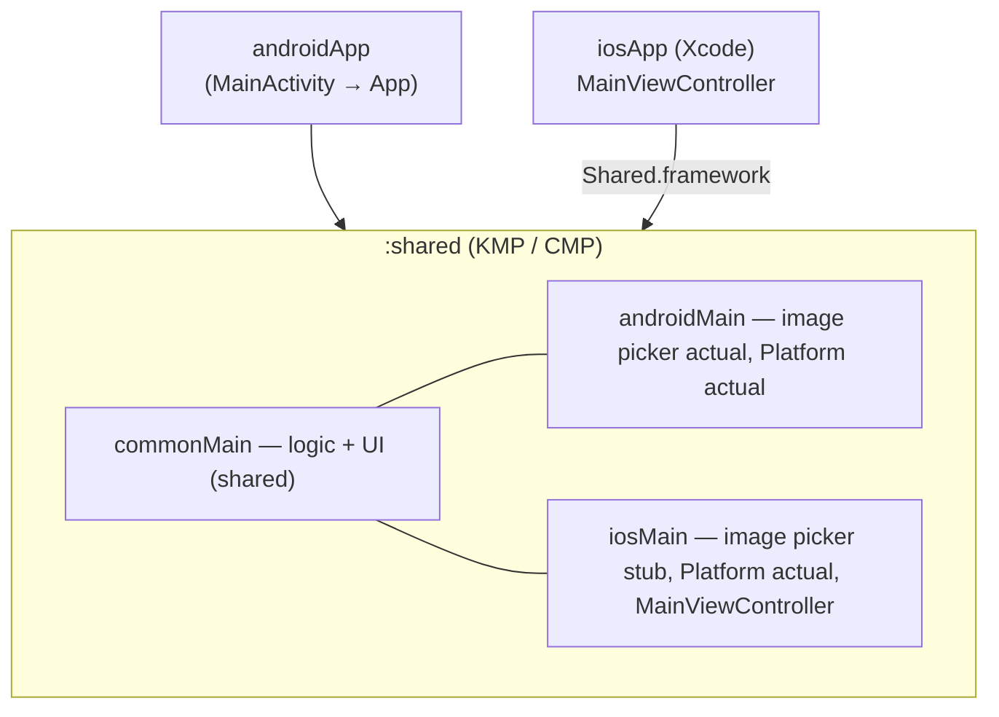

Two Gradle modules: `:androidApp` (Android host) and `:shared` (everything else). `iosApp/` is an
Xcode project that consumes the single exported static `Shared.framework`.

---

## 3. Architecture at a glance

Clean, inward-pointing layers. **Domain depends on nothing**; UI depends on presentation depends on
domain. Platform concerns (image bytes, analytics, rewards) are injected through **ports**
(interfaces) so the shared code never touches the network, auth, or platform APIs directly.

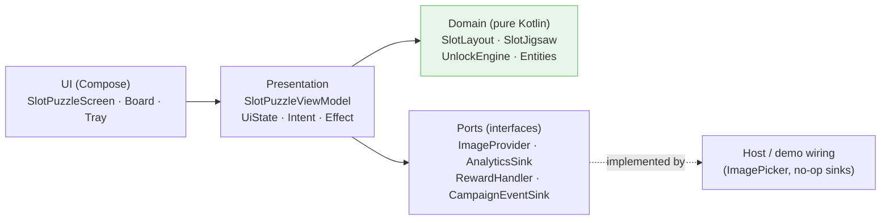

**Unidirectional data flow (UDF):**

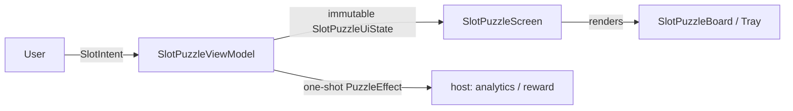

---

## 4. Package map

```
com.moe.puzzle
├── App.kt                       # @Composable App() → MaterialTheme { PuzzleDemoApp() }
├── Platform.kt / .android / .ios  # expect/actual platform info
├── demo/                        # runnable demo wiring (the app you see)
│   ├── PuzzleDemoApp.kt         # image button + count text field + slot puzzle
│   ├── ImagePicker.kt           # expect rememberImagePicker(): ImagePicker
│   ├── ImagePicker.android.kt   # actual: system photo picker → ImageBitmap
│   ├── ImagePicker.ios.kt       # actual: stub
│   └── ResourceImageProvider.kt # bundled fallback image
├── campaign/platform/
│   └── CampaignContracts.kt     # CampaignGame / CampaignServices (future plugin shell)
└── feature/puzzle/
    ├── domain/                  # pure Kotlin — no Compose, no platform
    │   ├── Entities.kt          # GridSpec, EdgeProfile, PuzzleConfig, …
    │   ├── UnlockEngine.kt      # progressive-unlock diff
    │   ├── Ports.kt             # ImageProvider, AnalyticsSink, RewardHandler, CampaignEventSink
    │   ├── PuzzleEvent.kt       # semantic events out
    │   ├── EdgeStrategy.kt      # (legacy grid) edge generation
    │   ├── GeneratePieces.kt    # (legacy grid) piece generation
    │   ├── UseCases.kt          # (legacy grid) thin use cases
    │   ├── LayoutResolver.kt    # (legacy grid) count → GridSpec
    │   └── slot/                # ★ the slot engine
    │       ├── SlotLayout.kt    # geometry types + SlotLayout
    │       └── SlotJigsaw.kt    # polyomino generator + planner
    ├── presentation/
    │   ├── SlotPuzzleViewModel.kt  # ★ layout-agnostic VM (state/intent/effect)
    │   └── Puzzle*.kt              # (legacy grid) VM/state/intent
    └── ui/
        ├── SlotPuzzleScreen.kt     # ★ slot board + tray + screen + shape helpers
        └── Puzzle*/Piece*.kt       # (legacy grid) board/tray/shape
```

`★` marks the active code path. See the next section about the legacy files.

---

## 5. Two engines (slot vs legacy grid)

The repo currently contains **two puzzle implementations**:

| | **Slot engine** (active) | **Legacy grid** (dormant) |
|---|---|---|
| Piece identity | `PieceSlot.id` | grid cell `id = row*cols + col` |
| Shape | arbitrary `Contour` (any polygon/knobs) | `EdgeProfile` (4-sided rectangle) |
| Placement check | nearest `anchor` → `id == targetSlotId` | `grid.idOf(cell) == id` |
| Supports non-grid layouts (center pieces) | **Yes** | No |
| Used by the demo / app | **Yes** | No (kept compiling, still tested) |

The legacy grid engine (`PuzzleViewModel`, `PuzzleBoard`, `PieceShape`, `EdgeStrategy`,
`generatePieces`, `LayoutResolver`) was the first version. The slot engine supersedes it — a grid is
just one kind of slot layout. The legacy files remain because their tests still pass and they document
the original approach; the intended cleanup is to delete them once nothing references them.

**The rest of this guide focuses on the slot engine.**

---

## 6. Domain layer

Pure Kotlin. No Compose, no Android, no coroutines beyond what the engine needs.

### 6.1 Shared value objects (`Entities.kt`)

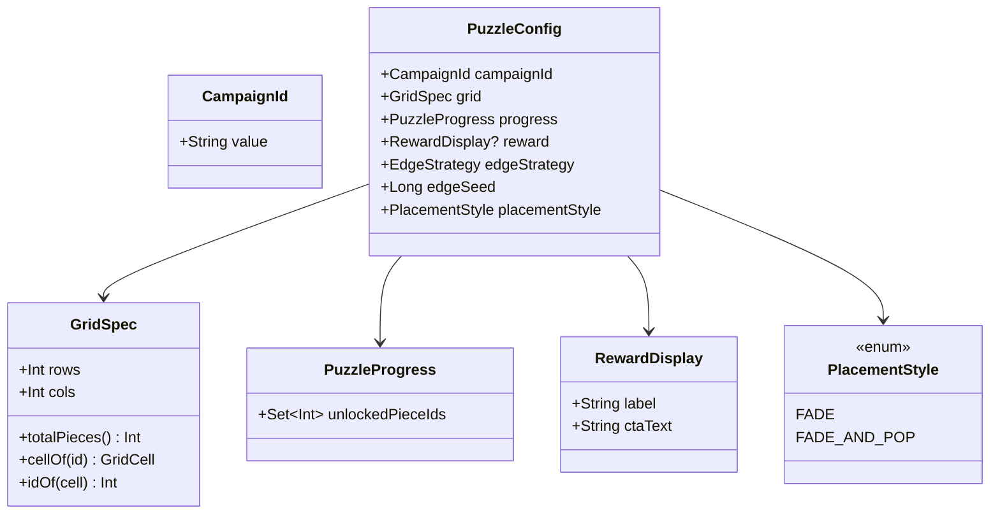

`PuzzleConfig`/`GridSpec`/`EdgeProfile`/`PuzzlePiece` are primarily the legacy grid model. The slot
engine reuses only the small, generic pieces: `CampaignId`, `RewardDisplay`, `PlacementStyle`,
`PuzzleProgress`.

### 6.2 `UnlockEngine` — progressive-unlock diff

Tracks which pieces are newly available so each unlock fires its event/animation exactly once
(prevents "re-animation on refresh").

```kotlin
class UnlockEngine(totalPieces: Int, initial: Set<Int>) {
    fun update(progress: PuzzleProgress): UnlockDelta   // newlyUnlocked = now - previous
    fun reset()
}
data class UnlockDelta(val newlyUnlocked: Set<Int>, val isComplete: Boolean)
```

### 6.3 Ports (`Ports.kt`) — the platform seam

The shared component **emits**; the host transports. These are `fun interface`s so they can be
lambdas.

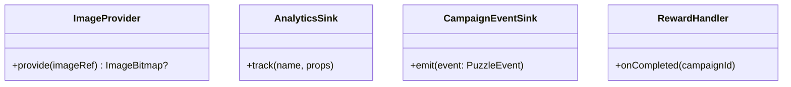

### 6.4 Events (`PuzzleEvent.kt`)

```kotlin
sealed interface PuzzleEvent {
    data class PieceUnlocked(val pieceId: Int)
    data class PiecePlaced(val pieceId: Int)
    data class WrongPlacement(val pieceId: Int, val cellId: Int)
    data class ProgressChanged(val placed: Int, val total: Int)
    data object PuzzleCompleted
    data class RewardTapped(val campaignId: String)
}
```

---

## 7. The slot engine in depth

> For the exact algorithms, constants, the bezier knob math, and the render loop, see the companion
> **[algorithms-and-rendering.md](algorithms-and-rendering.md)**. This section is the overview.

### 7.1 Geometry types (`slot/SlotLayout.kt`)

Everything lives in **normalized board space `[0,1]²`** — independent of pixel size and density.

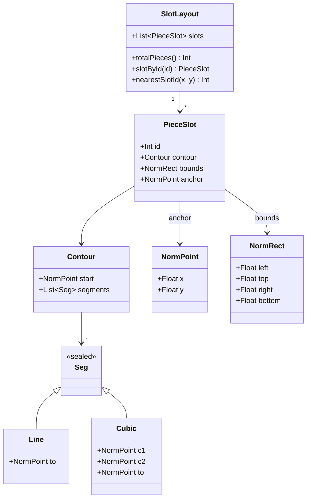

- **`contour`** — the piece outline (used to clip the image + draw the ghost). Lines for straight
  cuts; cubics for jigsaw knobs.
- **`bounds`** — bounding box, used to frame the tray thumbnail.
- **`anchor`** — representative center; `nearestSlotId(x,y)` returns the slot whose anchor is closest
  to a board point. **This replaces the grid's `idOf(cell)` for hit-testing.**

### 7.2 The polyomino jigsaw generator (`slot/SlotJigsaw.kt`)

Every layout is described by **assigning each cell of a fine grid to a piece id**. The generator then
traces each piece's outline and decorates shared edges with interlocking knobs.

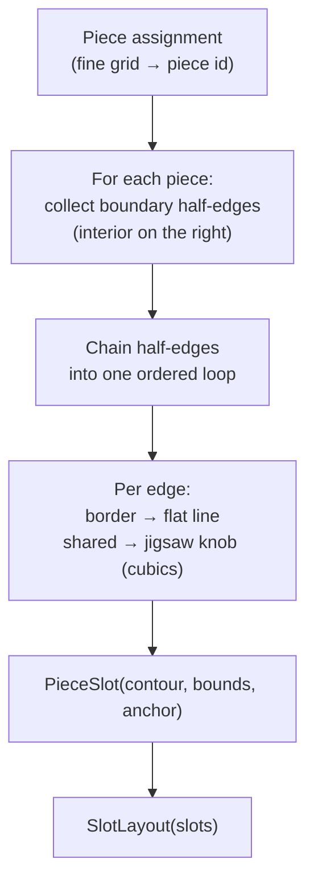

**Why a fine grid?** A "2×2 + center" isn't a grid — the center piece sits *between* cells. On a
**2× finer** grid it becomes a clean polyomino assignment: the center is the 4 middle cells; each
corner is its 2×2 block minus the one cell the center took (an L-tromino).

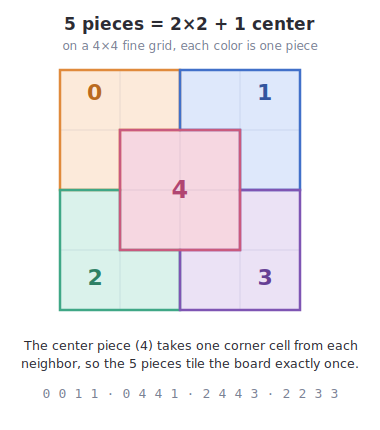

Example for `centerFiveLayout()` on a 4×4 fine grid (`0..3` = corners, `4` = center):

```
 0 0 1 1
 0 4 4 1
 2 4 4 3
 2 2 3 3
```

**Boundary tracing.** For a piece, each cell side whose neighbor is a *different* piece is a boundary
half-edge, emitted clockwise (interior on the right). Chaining them start→end yields one closed loop.
A guard asserts the loop consumed every edge — a disconnected piece would throw here, which is how the
tests catch bad layouts.

**Knob complementarity.** A shared edge is seeded (`seedBit`) to bulge toward one absolute side. Each
of the two pieces computes the knob from its own outward normal + that seed, so one sees a **TAB** and
its neighbor the matching **BLANK** — and the math guarantees both produce the *identical* curve, so
pieces interlock seamlessly. Knob size scales with edge length (`knobSegs`).

### 7.3 The layout planner (`planFor` → `gridPlusOverlaysLayout`)

`slotLayoutForCount(n)` maps any typed count to a layout:

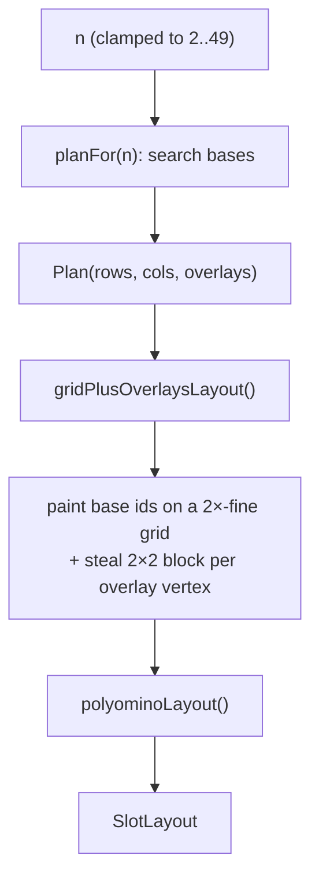

`planFor` searches base `rows×cols` grids and places the leftover `k = n − rows*cols` pieces as a
**single centered band on the middle row**. Two reasons:

1. **Safety** — a one-row band can never bite all four corners off a base cell, so no base piece ever
   disconnects (the tracer never fails).
2. **Symmetry** — a centered band reads as a balanced strip rather than a lopsided cluster.

`scoreOf` ranks candidates by: near-square aspect, **even row count** (so the band lands on the exact
center line), and a horizontally centered band. Examples:

| n | Chosen plan | Note |
|---|---|---|
| 5 | 2×2 + 1 center | fully centered |
| 7 | 2×3 + 1 | vertically centered; ½-cell off horizontally (unavoidable for 7) |
| 9 | 3×3 grid | no overlays |
| 11 | 2×4 + band of 3 | symmetric both axes |
| 13 | 4×3 + 1 (middle row) | vertically centered |

---

## 8. Presentation layer (UDF)

### 8.1 `SlotPuzzleViewModel` — layout-agnostic

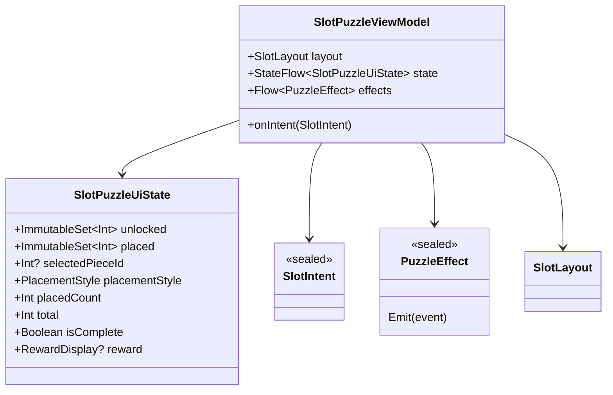

**Intents in:** `UnlockNext`, `Select(id)`, `PlaceSelectedAt(nx, ny)`, `PlacePieceAt(id, nx, ny)`,
`Reset`, `RewardTapped`. The two `Place*` intents take **normalized board coordinates**; the VM
resolves them to a target slot via `layout.nearestSlotId(nx, ny)` and validates `id == targetSlotId`.
This is the whole reason the VM is layout-agnostic — it never mentions rows/cols.

**State machine for one piece:**

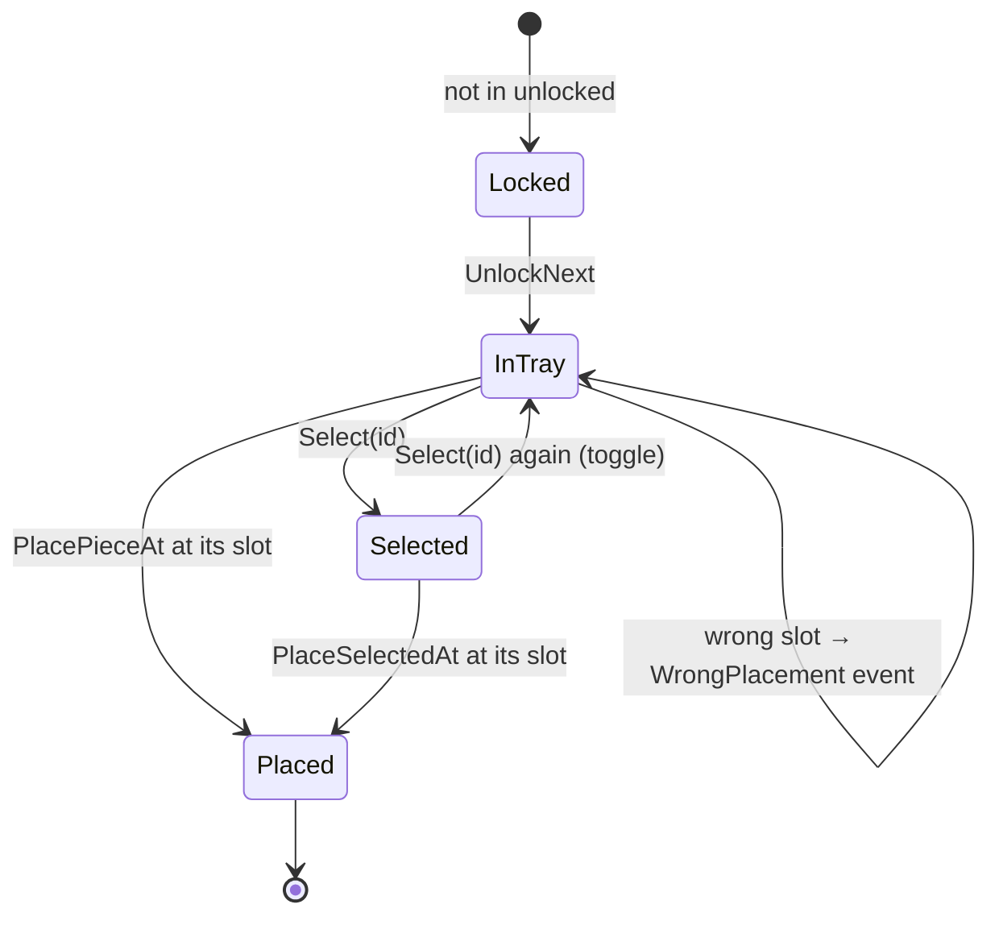

Board completion: `placedCount == total` → `isComplete = true` → emits `PuzzleCompleted` +
`rewardHandler.onCompleted(...)`.

---

## 9. UI layer & rendering

All in `ui/SlotPuzzleScreen.kt`. The screen is **state-hoisted**: it takes an immutable state + an
`onIntent` lambda.

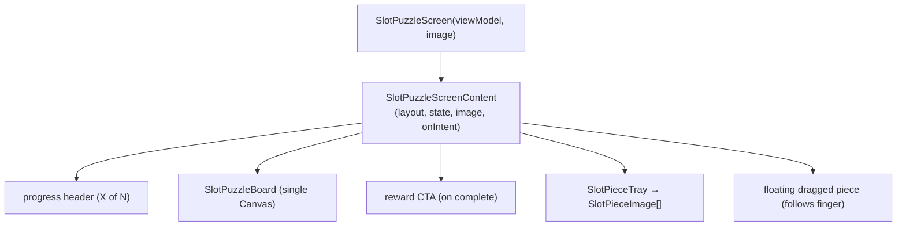

### Rendering pipeline (`SlotPuzzleBoard`)

One `Canvas`. The transform `scale(boardPx)` maps board space `[0,1]²` onto pixels, so all drawing
uses normalized coordinates:

1. Faint whole-image preview (alpha 0.12) so the board reads as a target.
2. For each slot:
   - **empty** → ghost stroke of its `contour` (highlighted green if it's the selected/dragged piece's
     home slot);
   - **placed** → the image **clipped to the contour**, faded/popped in via a per-slot `Animatable`
     read in the draw lambda (so only the draw phase re-runs, no recomposition).

Image clipping uses one bitmap for all pieces: `clipPath(contour) { drawImage(wholeImage) }`. Because
the contour is already in board space, clipping selects exactly that slot's fragment.

### Interaction

- **Tap-to-place** — tap a tray piece (`Select`), then tap the board; the board reports the normalized
  hit point → `PlaceSelectedAt`.
- **Drag** — long-press a tray item; the screen tracks the finger in **root coordinates**, draws a
  floating piece, and on release converts to normalized board coords → `PlacePieceAt`.
- Haptics (confirm/reject) fire immediately; the VM re-validates as source of truth.

---

## 10. Platform layer (expect/actual)

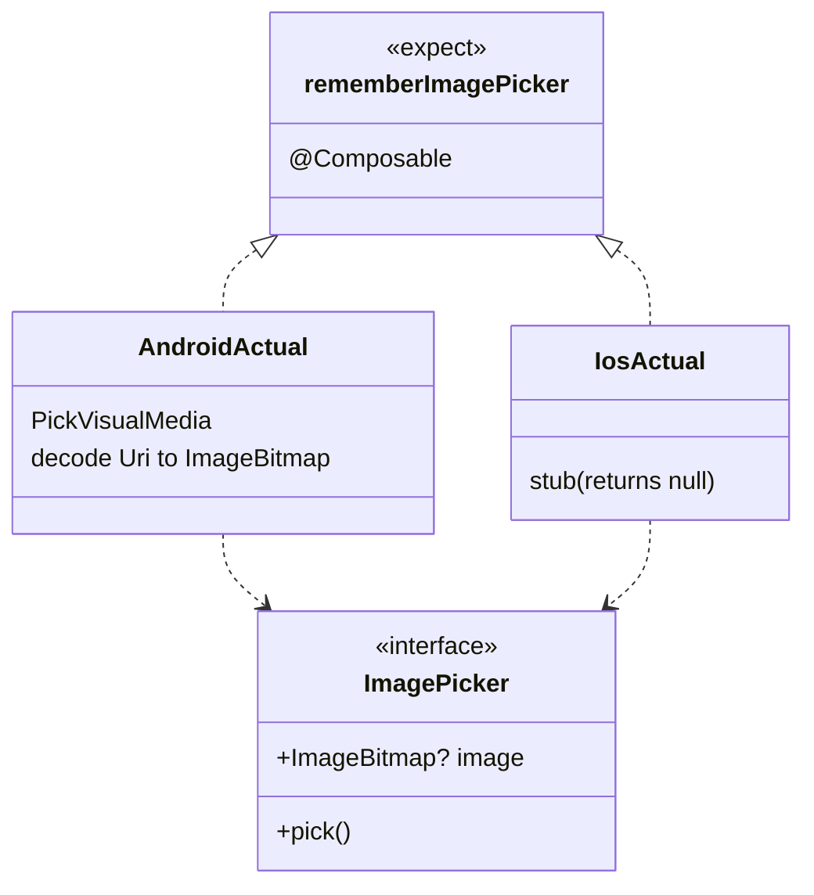

- **common** (`demo/ImagePicker.kt`) declares the `ImagePicker` interface + `expect rememberImagePicker()`.
- **android** (`ImagePicker.android.kt`) uses `ActivityResultContracts.PickVisualMedia` (the system
  photo picker — no storage permission), decodes the returned `Uri` off the main thread into an
  `ImageBitmap`, and exposes it as snapshot state.
- **ios** (`ImagePicker.ios.kt`) is a stub; the demo falls back to the bundled image.

Entry points: `App()` (common) → `MainActivity` (Android) / `MainViewController` (iOS).

---

## 11. End-to-end flows

### Pick image + type count → puzzle rebuilds

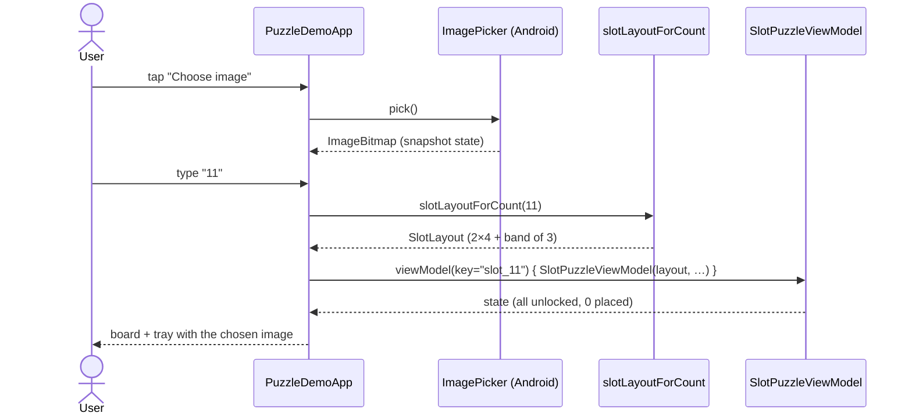

Note: the `viewModel` is **keyed by piece count**, so changing the number rebuilds it cleanly.

### Place a piece (drag)

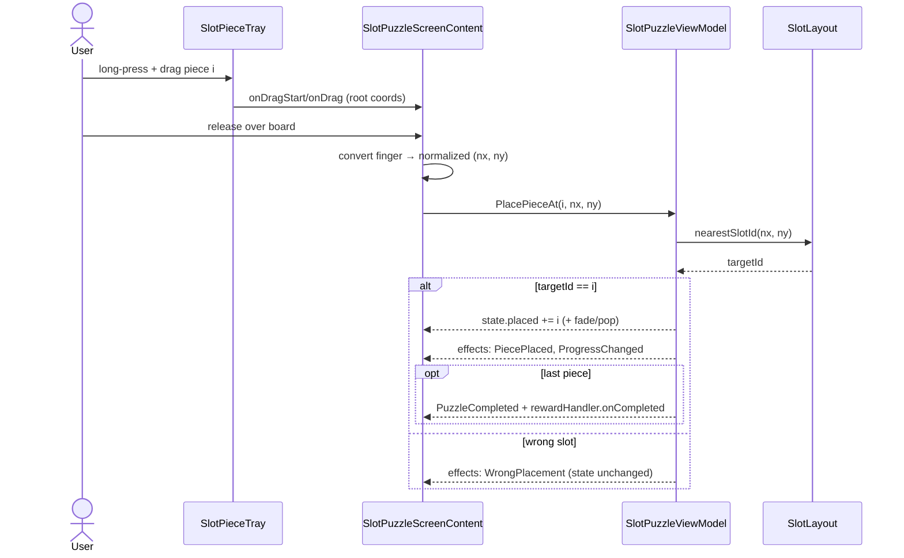

---

## 12. Coordinate systems

There are three, and conversions between them are the most error-prone part of the UI:

| Space | Range | Used by |
|---|---|---|
| **Normalized board** | `[0,1]²` | domain geometry (`Contour`, `anchor`), VM hit-testing |
| **Board pixels** | `0..boardPx` | the board `Canvas` (`scale(boardPx)` applies the transform) |
| **Root pixels** | whole screen | drag tracking (`positionInRoot`, `boundsInRoot`) |

Rules of thumb:
- The **domain** only ever speaks normalized board space.
- The **board Canvas** scales normalized → pixels with one `withTransform { scale(s) }`.
- **Drag** lives in root pixels; the screen converts the drop point to normalized using the board's
  `boundsInRoot()` before calling the VM.

---

## 13. Campaign platform contract (future)

`campaign/platform/CampaignContracts.kt` sketches a plugin shell for hosting multiple mini-games
(puzzle, scratch, spin…) under shared services. It is **scaffolding, not yet wired** into the app.

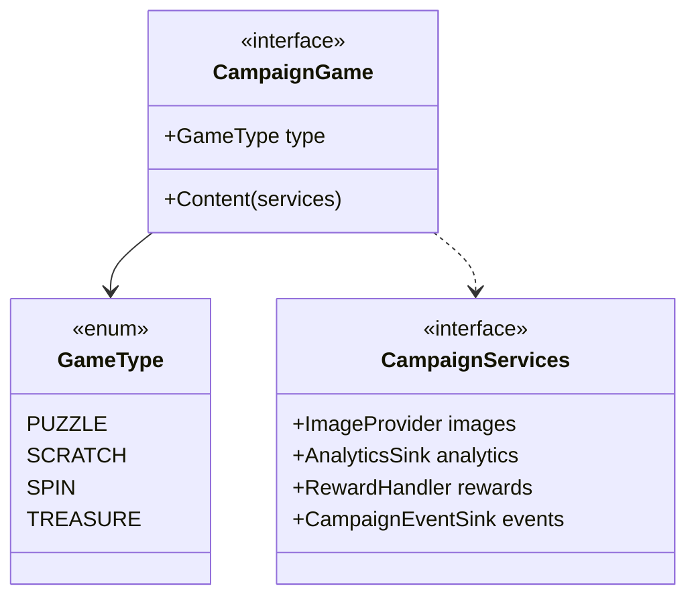

The idea: each game is a thin plugin (`config in, events out`); analytics/rewards/assets/events are
implemented once and reused. The slot puzzle would become the `PUZZLE` plugin.

---

## 14. Testing

Pure-Kotlin tests in `commonTest` run on both the Android host (Robolectric) and the iOS simulator.

| Test | Covers |
|---|---|
| `slot/SlotLayoutTest` | center-5 piece count & nearest-slot mapping; **all counts 2–49 build with exactly N pieces** (a disconnected piece would throw during tracing); clamping |
| `UnlockEngineTest` | unlock diff / idempotency (legacy) |
| `EdgeStrategyTest`, `UseCasesTest`, `PuzzleViewModelTest` | legacy grid engine |
| `PuzzleScreenUiTest` (androidHostTest) | legacy grid Compose UI |

The "all counts build" test is the key safety net for the slot planner: it guarantees no typed number
produces a broken layout.

---

## 15. Build & run

```bash
# Android app
./gradlew :androidApp:assembleDebug

# Compile shared for iOS simulator (sanity)
./gradlew :shared:compileKotlinIosSimulatorArm64

# Unit tests (Android host)
./gradlew :shared:testAndroidHostTest

# Unit tests (iOS simulator)
./gradlew :shared:iosSimulatorArm64Test
```

iOS app: open `iosApp/` in Xcode and run (consumes `Shared.framework`).

> Build note: the iOS targets are `iosArm64` + `iosSimulatorArm64` only. `iosX64` was removed because
> the Compose/lifecycle artifacts in use don't publish for it (it broke dependency resolution).

---

## 16. Extending the system

**Add a new layout shape (e.g. a special template):**
1. Produce a fine-grid `IntArray` piece assignment (or compose `gridPlusOverlaysLayout`).
2. Call `polyominoLayout(rows, cols, pieceOf, seed)` — you get knobs + bounds + anchors for free.
3. Add a `SlotLayoutTest` case (it'll throw if a piece is disconnected).

**Change how typed counts map to layouts:** edit `planFor`/`scoreOf` in `SlotJigsaw.kt`. Keep the
"single centered band" rule (or prove your placement keeps base pieces connected).

**Add jigsaw knobs / tune their size:** the knob silhouette is in `knobSegs` (the `0.37`/offset
constants control the bulb); it mirrors the legacy `PieceShape.addEdge`.

**Add a second mini-game:** implement `CampaignGame` (§13) and route by `GameType`.

---

## 17. Glossary

| Term | Meaning |
|---|---|
| **Slot** | One puzzle piece's target: outline + bounds + anchor (`PieceSlot`). |
| **Contour** | A piece's closed outline in normalized board space (`Line`/`Cubic` segments). |
| **Anchor** | A slot's representative center; used to resolve where a dropped piece belongs. |
| **Polyomino** | A piece made of one-or-more fine-grid cells; the generator traces its boundary. |
| **Overlay / center piece** | A piece that sits on an interior grid vertex (the non-grid pieces). |
| **Knob (TAB/BLANK)** | The interlocking bump on a shared edge; a TAB on one side is a BLANK on the other. |
| **Normalized board space** | The `[0,1]²` coordinate system all domain geometry uses. |
| **Port** | An interface the host implements (image, analytics, reward, events). |
| **UDF / MVI-lite** | Intent in → immutable state out → one-shot effects out. |
