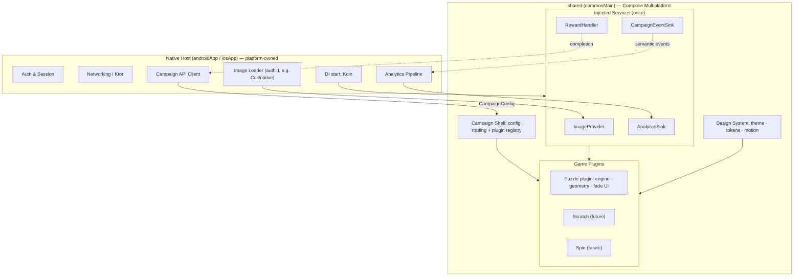
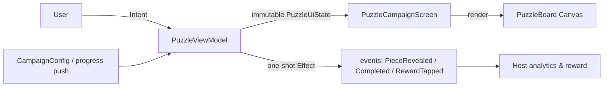
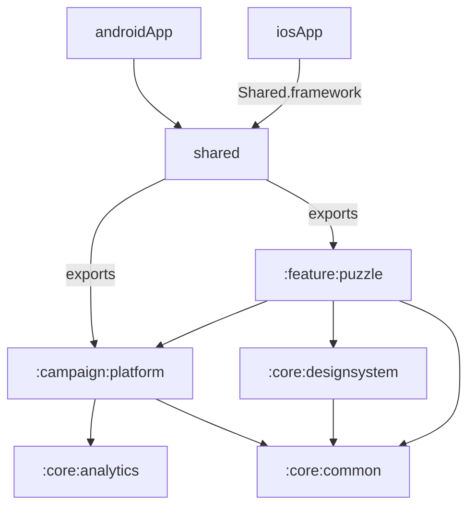
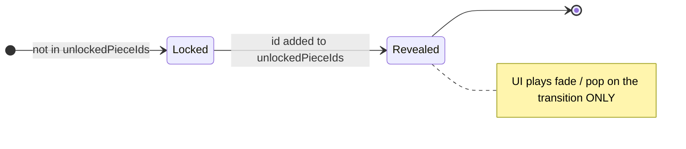
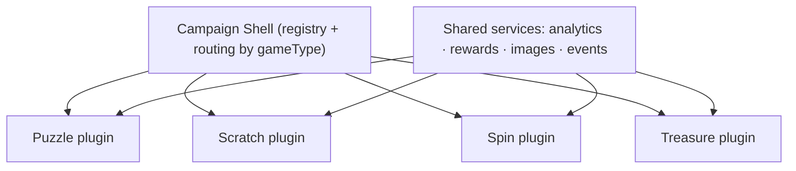

# Puzzle Campaign — Production Architecture Package

> **⚠️ Implementation status (deviations from this doc).** The shipped feature is a **tap-to-place /
> drag-and-drop jigsaw** with **progressive unlock**, *not* the "Fade / Collect & Reveal" mechanic this
> doc proposes. Concretely:
> - Each piece has two independent states: **unlocked** (available in the bottom tray) and **placed**
>   (dropped into its correct board slot). `PuzzleUiState` carries `unlocked` / `placed` /
>   `selectedPieceId` / `placedCount`; completion fires when all pieces are *placed*.
> - Interaction: tap a tray piece then tap its slot, **or** long-press-drag it onto the slot
>   (`PuzzleIntent.SelectPiece` / `PlaceAt` / `PlacePiece`). Drag/drop uses native CMP gestures
>   (`detectDragGesturesAfterLongPress` + `onGloballyPositioned`), no third-party lib.
> - Default shape is **`EdgeStrategy.Jigsaw`** (real interlocking knobs), `RevealStyle.FADE_AND_POP`.
> - The `Reveal*` names (`RevealEngine`, `RevealStyle`, `RevealDelta`) are retained but now drive
>   *unlock/placement* deltas. The rest of this doc (layering, DI, single-Canvas rendering, immutability,
>   testing strategy) still holds.
>
> **Audience:** Principal Engineer reviewing the proposal. This is the deeper engineering companion to
> `puzzle-campaign-master-document.md` — it takes the master doc's decisions to implementation depth and
> challenges two of them where a better trade exists.
>
> **Confirmed decisions:** (1) **Rectangular-first** piece shape with a pluggable `EdgeStrategy` (jigsaw
> opt-in later); (2) **Koin** for DI; (3) **Full CMP**; (4) **Fade** mechanic for v1. SKIE for Swift
> interop is deferred (adopt only if interop friction shows up).
>
> **Repo facts this is grounded in:** modules `:androidApp` + `:shared` (single exported `Shared` static
> framework), package `com.moe.puzzle`, Kotlin 2.4.0, CMP 1.11.1, Material3 1.11.0-alpha07, AGP 9.0.1,
> minSdk 24 / target 36, iOS `iosArm64` + `iosSimulatorArm64`. `commonMain` already has compose
> runtime/foundation/material3/ui + components-resources + lifecycle-viewmodel/runtime-compose. No DI /
> networking / image / serialization libs yet. Entry points stay `App()` (common) → `MainActivity`
> (Android) / `MainViewController` (iOS) / `ContentView.swift`.

---

## 1. Executive Summary

**Recommended architecture:** **Campaign Platform + Compose Multiplatform + Fade (Collect & Reveal)**,
built as a **plugin platform** where cross-cutting concerns (analytics, rewards, assets, config, events)
live once and each game (Puzzle first) is a thin plugin. UI and domain are **shared in `commonMain`**;
only image fetch/auth, analytics transport, and the app shell are platform-owned and injected through
narrow seams.

**Recommended implementation strategy:** **pragmatic, phased modularization.** Do **not** create 8
Gradle modules for one feature on day one — that is premature and adds real iOS framework-export
friction. Instead:

1. Build the feature now inside `:shared` behind **strict package boundaries** that mirror the target
   module graph.
2. Extract Gradle modules **when the second game arrives** — at that point extraction is mechanical
   because the package boundaries and the `CampaignGame` contract already exist.

**Two assumptions from the master doc I am challenging (details in §3, §8):**

- **Procedural jigsaw geometry is not required for v1.** Adopt **procedural geometry with a pluggable
  `EdgeStrategy`** where **rectangular (FLAT edges) is the default** and jigsaw tab/blank is an opt-in
  strategy on the *same* render pipeline. This keeps the "no pre-cut PNGs / cross-platform parity /
  density-crisp" benefits while removing the bezier-clipping cost, aliasing risk, and geometry bugs from
  the critical path. Jigsaw becomes a config flag later, not a rewrite.
- **Full-ceremony MVI is overkill for a leaf feature.** Use **MVI-lite UDF**: one `ViewModel` exposing
  an immutable `StateFlow<PuzzleUiState>`, intents in, effects out — the discipline of MVI without a
  reducer framework.

**Why this wins:** it delivers a runnable, accessible, test-covered Fade puzzle fast, while the platform
seam + plugin contract make game #2 (Scratch/Spin/Treasure) and mechanic #2 (Drag) additive rather than
a rewrite. The fade mechanic is gesture-free → **accessible by construction** and ~⅓ the cost of drag
for ~90–95% of the engagement.

---

## 2. Decision Matrix — Technology (CMP vs KMP+Native vs Native)

| Dimension | **A. Full CMP** (shared logic + UI) | **B. KMP logic + Native UI** | **C. Fully Native** |
|---|---|---|---|
| UI code | Once (commonMain) | **Twice** (Compose + SwiftUI) | **Twice** |
| Domain/logic | Once | Once | **Twice** |
| Animations/gestures | Once | Twice | Twice |
| Cross-platform parity | Guaranteed by construction | Manual, drifts | Manual, drifts |
| **Pros** | Fastest feature velocity; perfect parity; one design system; reuse compounds per game | Fully native feel; iOS team stays in SwiftUI; smaller iOS binary | Teams fully independent; no KMP/CMP learning curve |
| **Cons** | Compose runtime on iOS (~+9 MB); iOS team adopts Compose; tied to JetBrains cadence | UI/animation/gesture written twice; visual drift | Everything duplicated; highest cost |
| **Risks** | iOS Compose maturity for complex gfx; debugging Compose-on-iOS less familiar | The *hardest* code (reveal/clip/animation) duplicated; parity QA burden | Highest bug surface; two reveal engines diverge |
| **Long-term maintenance** | **Lowest** — fix once | Medium — fix UI twice | **Highest** |
| **Team impact** | One feature team owns both platforms; iOS upskills on Compose | Two UI workstreams to coordinate | Two full teams, two backlogs |
| **Delivery impact** | Fastest to first delivery and to game #2 | Slower; double UI passes | Slowest |
| **Verdict** | ✅ **Recommended** | Acceptable only if iOS bans Compose | Avoid |

**Decision: A — Full CMP.** This repo is already a CMP project (the `Shared` framework + `App()` entry
exist), so the adoption cost is already paid. For a graphics-and-animation-heavy reveal puzzle, "write
the hard part once" is exactly where CMP pays off. The one combination to avoid entirely is **B + Drag**
— it duplicates gestures, hit-testing, snap, and animation (the costliest code).

---

## 3. Product Decision Matrix — Fade vs Drag & Drop

| Dimension | **Fade (Collect & Reveal)** | **Drag & Drop** |
|---|---|---|
| UX flow | Unlock → reveal → reward (passive) | Unlock → drag → snap → celebrate → reward (active) |
| Engineering effort | **1×** | 3× (5× with custom jigsaw shapes) |
| Complexity | Low — diff + alpha animation | High — gestures, hit-test, snap, collision, tray |
| Accessibility | **Excellent** — no gestures; trivial TalkBack/VoiceOver | Needs full tap/keyboard fallback or it excludes users |
| Retention impact | ~90–95% of drag | 100% (tactile "wow") baseline |
| QA effort | Low — deterministic from `unlockedPieceIds` | High — gesture matrix × screen sizes × a11y fallback |
| Reuse to future games | High — Scratch/Spin/Treasure are also passive reveals | Low — drag physics rarely reused |

**Decision: Fade for v1, Drag as a configurable v2 mode.** Architect the domain so the **reveal state
is identical** for both mechanics (the set of revealed pieces); only the *interaction* differs. Drag
then slots in as an alternate input layer over the same engine and rendering — still pure CMP
(`detectDragGestures` + snap + a `DRAGGING` piece state), no framework switch.

---

## 4. Recommended Final Architecture

The platform owns cross-cutting concerns once; each game is a dumb plugin: **config in, semantic events
out.** Auth, networking, analytics transport, and image fetch live in the **host** and are injected as
services. The shared layer never touches the network or auth.



**Layered dependency direction (inward-only; domain depends on nothing):**

```mermaid
flowchart LR
    UI["UI / Compose\n(state hoisting, UDF)"] --> VM["Presentation\nViewModel + UiState"]
    VM --> UC["Use cases"]
    UC --> DOM["Domain\nengine · geometry · entities\n(pure Kotlin)"]
    VM --> PORT["Ports (interfaces):\nImageProvider · AnalyticsSink\nRewardHandler · CampaignEventSink"]
    PORT -. implemented by .-> HOST["Host adapters\n(platform)"]
    classDef pure fill:#e8f5e9,stroke:#66bb6a; class DOM pure;
```

**UDF / state flow (MVI-lite):**



**Responsibilities & ownership**

| Concern | Owner | Where |
|---|---|---|
| Reveal rules, completion, cut geometry | Feature team | `shared` domain (pure Kotlin) |
| Board rendering, fade/ghost, theming | Feature team | `shared` UI (CMP) |
| State holding, intents, effects | Feature team | `shared` presentation (ViewModel) |
| Image bytes + auth | Host/platform team | `androidApp` / `iosApp` via `ImageProvider` |
| Analytics transport | Host/platform team | host via `AnalyticsSink` |
| Reward claim / completion record | Host/platform team | host via `RewardHandler` + API |
| Config delivery + schema | Backend team | API → `CampaignConfig` |

---

## 5. Module Structure

**Principle:** package boundaries now, Gradle modules when a second game justifies the iOS-export cost.

### 5a. Target module graph (when ≥2 games)



| Module | Owns | Depends on |
|---|---|---|
| `:androidApp` | Android host: `MainActivity`, Koin start, host adapters (Coil image loader, analytics) | `:shared` |
| `:iosApp` (Xcode) | iOS host: SwiftUI, Koin start, host adapters | `Shared.framework` |
| `:shared` | **Umbrella that builds/exports the single `Shared` framework**; aggregates + `export`s the modules below | platform + puzzle + core |
| `:campaign:platform` | `CampaignGame` contract, `CampaignServices`, config routing, shell | `:core:*` |
| `:feature:puzzle` | Puzzle domain (engine, geometry), presentation (VM/state), UI (board/screen) | `:campaign:platform`, `:core:designsystem`, `:core:common` |
| `:core:designsystem` | Theme, color/spacing/motion tokens, reusable composables | `:core:common` |
| `:core:analytics` | `AnalyticsSink` + event contracts | `:core:common` |
| `:core:common` | Dispatchers, `Result`, coroutine utils, immutable-collection helpers | — |
| `:feature:scratch` / `:spin` (future) | New plugins | same as `:feature:puzzle` |

**iOS export strategy:** keep **one** exported framework (`baseName = "Shared"`, static). `:shared`
uses `api(project(...))` + `export(project(...))` so Swift sees the needed public types. Avoid
one-framework-per-module (Xcode integration pain). Consider **SKIE** to make `suspend`/`Flow`/
sealed-interface/enum interop ergonomic in Swift — but keep the *public* game boundary on plain
callbacks so SKIE stays optional, not load-bearing.

### 5b. Recommended NOW (MVP) — package layout inside `:shared`

```
shared/src/commonMain/kotlin/com/moe/puzzle/
  core/
    common/            # Dispatchers, Result, immutable helpers
    designsystem/      # CampaignTheme, tokens, motion specs, reusable composables
    analytics/         # AnalyticsSink + event contracts
  campaign/
    platform/          # CampaignGame, CampaignServices, GameType, Shell
  feature/puzzle/
    domain/            # entities, value objects, EdgeStrategy, RevealEngine, geometry, use cases
    presentation/      # PuzzleViewModel, PuzzleUiState, PuzzleIntent, PuzzleEffect
    ui/                # PuzzleCampaignScreen, PuzzleBoard, PieceShape, previews
  demo/                # demo wiring: ResourceImageProvider, sample config, App() host
```

Extraction to Gradle modules later = move each package; imports are already clean because nothing
crosses a boundary it shouldn't (enforce with a Konsist rule).

---

## 6. Domain Layer Design (pure Kotlin, no Compose, no platform)

**Entities & value objects**

```kotlin
@JvmInline value class CampaignId(val value: String)

data class GridSpec(val rows: Int, val cols: Int) {
    val totalPieces get() = rows * cols
    fun cellOf(id: Int) = GridCell(id / cols, id % cols)   // canonical id = row*cols + col
}
data class GridCell(val row: Int, val col: Int)

enum class EdgeType { FLAT, TAB, BLANK }                    // TAB out, BLANK in
data class EdgeProfile(val top: EdgeType, val right: EdgeType, val bottom: EdgeType, val left: EdgeType)
data class PuzzlePiece(val id: Int, val cell: GridCell, val edges: EdgeProfile)   // immutable geometry

enum class RevealStyle { FADE, FADE_AND_POP }
data class RewardDisplay(val label: String, val ctaText: String = "Claim")

data class PuzzleConfig(
    val campaignId: CampaignId,
    val grid: GridSpec,
    val progress: PuzzleProgress,
    val reward: RewardDisplay? = null,
    val edgeStrategy: EdgeStrategy = EdgeStrategy.Rectangular,
    val edgeSeed: Long = campaignId.value.hashCode().toLong(),
    val revealStyle: RevealStyle = RevealStyle.FADE,
)
data class PuzzleProgress(val unlockedPieceIds: Set<Int>)   // the revealed set IS the state
```

**State machines**



Board: `IN_PROGRESS → COMPLETED` when `unlockedPieceIds.size == grid.totalPieces`.

**Reveal engine** — the diff is the crux (prevents the "re-animation" bug):

```kotlin
data class RevealDelta(val newlyRevealed: Set<Int>, val isComplete: Boolean)

class RevealEngine(private val totalPieces: Int, initial: Set<Int> = emptySet()) {
    private var previous = initial
    fun update(p: PuzzleProgress): RevealDelta {
        val now = p.unlockedPieceIds
        val newly = now - previous           // only just-earned ids animate
        previous = now
        return RevealDelta(newly, now.size == totalPieces)
    }
    fun reset() { previous = emptySet() }
}
```

`initial` supports resume: pre-unlocked pieces don't animate on first load. Idempotent on same progress
(empty delta → no re-fade); tolerant of shrinking sets.

**Edge strategy** (unifies rectangular & jigsaw on one pipeline):

```kotlin
fun interface EdgeStrategy {
    fun edgesFor(cell: GridCell, grid: GridSpec, seed: Long): EdgeProfile
    object Rectangular : EdgeStrategy { /* all edges FLAT */ }
    object Jigsaw : EdgeStrategy { /* seeded complementary TAB/BLANK; borders FLAT */ }
}
fun generatePieces(grid: GridSpec, strategy: EdgeStrategy, seed: Long): List<PuzzlePiece>
```

**Use cases** (thin, pure): `GeneratePiecesUseCase`, `ComputeRevealDeltaUseCase`,
`IsCampaignCompleteUseCase`. Each is trivially unit-testable with no mocks.

---

## 7. UI Architecture (Compose Multiplatform)

**Screen structure** — `App()` (unchanged signature) → `CampaignTheme { PuzzleCampaignScreen(...) }`.
`PuzzleCampaignScreen` is **state-hoisted**: it takes immutable `PuzzleUiState` + an `onIntent` lambda
and renders; it holds no business state.

**State management (MVI-lite UDF)**

```kotlin
@Immutable
data class PuzzleUiState(
    val grid: GridSpec,
    val pieces: ImmutableList<PuzzlePiece>,        // kotlinx.collections.immutable → Compose-stable
    val revealed: ImmutableSet<Int>,
    val revealStyle: RevealStyle,
    val revealedCount: Int,
    val total: Int,
    val isComplete: Boolean,
    val reward: RewardDisplay?,
)

sealed interface PuzzleIntent {
    data object RevealNext : PuzzleIntent
    data object Reset : PuzzleIntent
    data class Unlock(val id: Int) : PuzzleIntent
    data object RewardTapped : PuzzleIntent
}

sealed interface PuzzleEffect {
    data class Emit(val event: PuzzleEvent) : PuzzleEffect
}

class PuzzleViewModel(config: PuzzleConfig, /* injected ports */) : ViewModel() {
    val state: StateFlow<PuzzleUiState>     // single source of truth, immutable
    val effects: Flow<PuzzleEffect>         // one-shot (Channel/SharedFlow)
    fun onIntent(i: PuzzleIntent) { /* update progress → engine.update → new state + effects */ }
}
```

`viewModel()` from `lifecycle-viewmodel-compose` (already a dependency) retrieves it on both platforms;
on iOS the `ViewModelStoreOwner` comes from `ComposeUIViewController`.

**Composables:** `PuzzleCampaignScreen` (header `X of N` via `LinearProgressIndicator`, board, reward
CTA), `PuzzleBoard` (single `Canvas`), `PieceShape` (pure path builder). Board is a pure renderer
reading a per-piece alpha map — no business logic.

**Navigation boundaries:** the puzzle is a **leaf screen** the host embeds — navigation stays in the
host. Do **not** pull a nav library into the feature. When the *campaign platform shell* needs to route
between multiple games, introduce **Decompose** (or CMP Navigation) **at the shell**, not the leaf.

**Previews:** `@Preview` composables in `feature/puzzle/ui` with a fake in-memory `ImageProvider` and
fixed seed, showing locked/partial/complete states. Drives fast iteration without a backend.

**Theming:** `CampaignTheme` wraps `MaterialTheme` with campaign tokens (color, spacing, motion
durations). Piece/ghost colors come from tokens, not hardcoded — enables per-campaign skinning.

**Accessibility** (first-class, not bolted on): the board container exposes semantics —
`stateDescription = "$revealedCount of $total pieces revealed"`, `liveRegion = Polite` so TalkBack/
VoiceOver announce each reveal; reward CTA is a real focusable `Button` with `contentDescription`.
Fade is gesture-free — there is no gesture to make accessible. `testTag`s on board + CTA for UI tests.

---

## 8. Puzzle Rendering Strategy

| Axis | **A. Rectangular pieces** | **B. Procedural jigsaw geometry** |
|---|---|---|
| Implementation cost | **Low** (FLAT edges → straight clip) | High (seeded complementary tabs, 3-cubic bezier per side) |
| Performance | Cheapest clip/draw | Bezier `clipPath` per piece; heavier; aliasing to manage |
| Maintainability | Trivial geometry | Geometry bugs (mismatched tabs, bounding-box overflow) |
| Scalability | Same pipeline as jigsaw | Same pipeline + edge-gen complexity |
| Visual appeal | "Grid reveal" | True "jigsaw" feel |

**Recommendation — challenging the master doc:** adopt **one render pipeline driven by `EdgeStrategy`**,
with **`Rectangular` as the v1 default** and **`Jigsaw` opt-in via config**. Both are procedural (no
pre-cut PNGs → cross-platform parity, density-crisp), but rectangular removes the bezier work from the
critical path. Switching to jigsaw later is a config flag, not a rewrite.

**Rendering pipeline (applies to both strategies):** a **single `Canvas`** — draw all **ghost
outlines** first (`drawPath` stroke at low alpha, optional dimmed image fill to show the whole picture
forming), then each revealed piece:

```kotlin
clipPath(piecePathScaledToPx) {
    drawImage(bitmap, srcOffset, srcSize, dstOffset, dstSize, alpha = pieceAlpha)
}
```

`clipPath` is a draw-time clip with **no layout bounds** — jigsaw tabs paint freely into neighbor cells;
single draw loop = deterministic z-order; `drawImage(alpha=)` composites per piece (no translucent-seam
artifacts from overlapping composables). `FADE_AND_POP` adds `withTransform { scale(s, s, pivot =
cellCenter) }`, `s` 0.9→1.0. Path is built in normalized `[0,1]²` then scaled per draw → re-rasterized
at true device pixels (crisp at any density). All APIs confirmed in CMP 1.11.1 commonMain.

**Why not `Modifier.clip` per piece:** Compose clips children to their layout bounds — a tab protruding
beyond the cell box gets cut off unless every piece is over-sized and negatively offset. Cross-sibling
z-order is awkward. Overlapping translucent composables show seams during fade. The single `Canvas`
avoids all three.

---

## 9. Event System

Three event families, all flowing **out** of the dumb component via narrow sinks; the host owns
transport and side effects.

```kotlin
sealed interface PuzzleEvent {
    data class PieceRevealed(val pieceId: Int) : PuzzleEvent
    data class ProgressChanged(val revealed: Int, val total: Int) : PuzzleEvent
    data object PuzzleCompleted : PuzzleEvent
    data class RewardTapped(val campaignId: String) : PuzzleEvent
}

fun interface AnalyticsSink    { fun track(name: String, props: Map<String, Any?>) }
fun interface CampaignEventSink { fun emit(event: PuzzleEvent) }
fun interface RewardHandler    { fun onCompleted(campaignId: CampaignId) }
```

| Family | Produced by | Consumed by | Ownership |
|---|---|---|---|
| **Analytics** (`screen_view`, `piece_revealed`, `campaign_completed`) | platform shell mapping `PuzzleEvent` | host analytics pipeline | Host (transport), feature (semantics) |
| **Campaign** (`PuzzleCompleted`, `ProgressChanged`) | puzzle plugin | shell → host | Feature defines, host routes |
| **Reward** (`RewardTapped`, completion) | puzzle plugin | `RewardHandler` → host API | Host — money/claim never in shared |

**Rule:** the shared component **emits**; it never calls analytics SDKs or reward APIs directly. This
keeps a second analytics SDK out of the binary and keeps auth/money in the host.

---

## 10. Backend Contract

**DTOs** (kotlinx.serialization; never deserialize straight into domain — map DTO → domain via an
anti-corruption layer):

```kotlin
@Serializable
data class CampaignDto(
    val schemaVersion: Int = 1,
    val campaignId: String,
    val gameType: String,               // "PUZZLE" — drives plugin routing
    val grid: GridDto,
    val imageRef: String,               // host resolves to auth'd bytes
    val progress: ProgressDto,
    val reward: RewardDto? = null,
)
@Serializable data class GridDto(val rows: Int, val cols: Int)
@Serializable data class ProgressDto(val unlockedPieceIds: List<Int>)
@Serializable data class RewardDto(val type: String, val label: String, val ctaText: String = "Claim")
```

Example payload:
```json
{
  "schemaVersion": 1, "campaignId": "summer2026", "gameType": "PUZZLE",
  "grid": { "rows": 4, "cols": 4 }, "imageRef": "summer2026_main",
  "progress": { "unlockedPieceIds": [0,1,2,3,4,5] },
  "reward": { "type": "data_bundle", "label": "10 GB", "ctaText": "Claim" }
}
```

**Versioning:** `schemaVersion` from day 1; `Json { ignoreUnknownKeys = true; coerceInputValues = true }`
so additive fields don't break old clients. Breaking changes bump `schemaVersion`; the client maps each
known version to the same domain model. `gameType` is the routing discriminator for the plugin registry.

**Client vs backend split**

| Backend owns | Client owns |
|---|---|
| `gameType`, grid size, `unlockedPieceIds`, total, reward, `imageRef`, schema version | Cut geometry, reveal animation, completion rendering, edge seed default |

Completion is **recorded by the host** via its own authenticated API after the plugin emits
`PuzzleCompleted` — the shared component has no network access.

---

## 11. Testing Strategy

**Shared / domain (`commonTest`, kotlin.test — runs on Android host AND iOS sim):**
- `RevealEngineTest`: first update = all newly; second = delta only; **same progress twice → empty
  delta** (the no-re-fade guard); completion exactly at `size==total`; shrinking set → empty, no crash;
  seeded `initial` → first delta empty (resume path).
- `EdgeGeneratorTest` (Jigsaw): deterministic per seed; borders FLAT; **neighbor complementarity**
  (horizontal & vertical: one side TAB ↔ neighbor BLANK); interior never FLAT. Rectangular: all FLAT.
- `PuzzleViewModelTest`: intents → expected `PuzzleUiState` transitions and `PuzzleEffect`s; use
  **Turbine** + `kotlinx-coroutines-test` `runTest`.
- State-machine tests: Locked→Revealed only on unlock; board IN_PROGRESS→COMPLETED.

**Compose UI tests:** `runComposeUiTest` (multiplatform in CMP 1.11): assert header text, reward CTA
appears at completion, `testTag`/semantics present. Drive via `onIntent`, assert rendered state.

**Screenshot tests:** **Roborazzi** (Android/JVM) for locked/partial/complete board states with a fixed
seed + fake image — gates visual regressions on the geometry/clip pipeline. iOS pixel snapshots are not
first-class in CMP today; rely on `iosSimulatorArm64Test` for logic parity + manual iOS visual QA.

**Integration:** Android — `:androidApp:assembleDebug` + install + manual reveal-to-completion. iOS —
`:shared:linkDebugFrameworkIosSimulatorArm64` + Xcode run; `:shared:iosSimulatorArm64Test` proves
pure-Kotlin parity from Windows/CI.

**Accessibility:** semantics assertions in UI tests (`stateDescription`, `liveRegion`, CTA role);
manual TalkBack + VoiceOver pass (announce each reveal, focus order, CTA actionable). For the future
Drag mode, an accessible **tap-to-place** fallback is a hard requirement, tested before drag ships.

---

## 12. Performance Strategy (CMP-specific)

- **Stability:** `@Immutable` `PuzzleUiState`; use **`kotlinx.collections.immutable`** (`ImmutableList`/
  `ImmutableSet`) — plain `List`/`Set` interfaces are *unstable* to Compose and defeat lambda skipping.
- **Recomposition control:** state-hoisted, single immutable state object; pass primitives/stable types;
  hoist lambdas with `remember`. Header reads only `revealedCount`/`total` (not the whole piece list).
- **Animate in the draw phase, not by recomposing:** per-piece alpha lives in a remembered
  `Map<Int, Animatable<Float>>`; the `Canvas` draw lambda reads `.value` → only the **draw** phase
  re-runs on each animation frame, **no recomposition** of the composition tree. This is the key perf
  lever for the reveal.
- **`remember` / keys:** `pieces`, `engine`, and the animatable map are `remember`-keyed by
  `(grid, edgeSeed, strategy)` so they survive recomposition and progress changes (prevents re-fade).
- **`derivedStateOf`:** for derived flags (`isComplete`, "any animation running") computed from state to
  avoid redundant reads.
- **Image loading:** host provides a decoded `ImageBitmap` once via `ImageProvider`; the board slices it
  with `drawImage(srcOffset/srcSize)` — **one bitmap, N clips**, no per-piece decode. Keep source ≥1024px
  so clipped slices downsample (sharper).
- **Animation:** `Animatable` + `tween(~350ms)` per piece, launched only for the delta. Do **not** wrap
  the whole board in one `graphicsLayer` alpha (would fade everything). `FADE_AND_POP` scale pivots at
  cell center so neighbors realign at scale 1.
- **iOS:** Skia-backed; antialiasing on by default. Watch the ~+9 MB Compose-runtime binary cost
  (confirm it fits the app budget). Static framework relink required after shared-UI changes.

---

## 13. Risk Analysis

| Risk | Type | Impact | Mitigation |
|---|---|---|---|
| Re-animation bug (revealed pieces re-fade on refresh) | Compose/state | High | Engine diff + remembered animatable map keyed by `(grid,seed,strategy)`; unit + UI test the idempotency |
| iOS Compose maturity for complex graphics | iOS/CMP | Med | Rectangular-first lowers gfx complexity; validate clip/anim on iOS sim early in Phase 1 |
| iOS binary size (~+9 MB Compose runtime) | iOS | Med | Confirm app budget up front; static framework; no extra heavy deps in shared |
| Stale iOS framework → old UI shipped | iOS build | Med | `linkDebugFramework…` as a required CI step; document; gate on it |
| `imageResource` 1×1 placeholder smear | CMP resources | Low | `ImageProvider` returns `null` until real bitmap; board draws ghosts meanwhile |
| Over-modularization slows MVP / iOS export pain | KMP/build | Med | Phased modularization: packages now, Gradle modules at game #2 |
| Compose-instability via `List`/`Set` in state | Compose perf | Med | `kotlinx.collections.immutable` + `@Immutable`; Compose compiler metrics in CI |
| Swift interop friction (Flow/suspend/sealed) | KMP/iOS | Med | Public game boundary = plain callbacks; adopt SKIE for internal ergonomics only |
| Material3 alpha (1.11.0-alpha07) churn | Dependency | Low | Pin versions; stick to stable M3 components (Button/Text/ProgressIndicator) |
| Geometry bugs in jigsaw (tab/blank mismatch) | Domain | Med (only if Jigsaw enabled) | Complementarity unit tests; jigsaw off by default |
| Drag mode accessibility regression (v2) | Product/a11y | High (v2) | Mandatory tap/keyboard fallback, tested, before drag ships |

---

## 14. Future Evolution (no rewrite)

The `CampaignGame` plugin contract + `CampaignServices` make new games purely additive:

```kotlin
enum class GameType { PUZZLE, SCRATCH, SPIN, TREASURE }

interface CampaignServices {
    val images: ImageProvider
    val analytics: AnalyticsSink
    val rewards: RewardHandler
    val events: CampaignEventSink
}

interface CampaignGame {
    val type: GameType
    @Composable fun Content(config: CampaignConfig, services: CampaignServices)
}
```



- **Scratch / Spin / Treasure:** new `:feature:*` modules implementing `CampaignGame`; reuse all shared
  services, theme, analytics, reward flow. Each ~3–5 days because the platform already exists.
- **Drag puzzle (v2):** same puzzle domain + reveal state; add a `DRAGGING` piece state +
  `detectDragGestures` + snap over the existing board — still pure CMP, plus the mandatory accessible
  tap-to-place fallback.
- **Jigsaw visuals:** flip `edgeStrategy = EdgeStrategy.Jigsaw` in config — no pipeline change.

---

## 15. Implementation Roadmap

Assumes 1–2 engineers, existing CI; estimates in engineer-days.

```mermaid
gantt
    title Puzzle Campaign — first delivery
    dateFormat X
    axisFormat %s
    section Foundation
    Tooling DI(Koin) serialization immutable-colls package-skeleton CI :0, 2
    section Domain core
    Entities + EdgeStrategy + RevealEngine + use cases + tests :2, 4
    section Rendering
    PieceShape + single-Canvas board rectangular + ghost/fade :4, 7
    section Presentation and UI
    ViewModel + UiState + screen + previews + a11y semantics :7, 9
    section Platform seams and iOS
    Ports image/analytics/reward + iOS framework link :9, 10
    section Hardening
    Screenshot + UI tests + completion/reward + backend mapping + QA :10, 12
```



| Phase | Deliverable | Days | Depends on |
|---|---|---|---|
| 0 Foundation | Koin, kotlinx.serialization, kotlinx.collections.immutable added; package skeleton (§5b); CI runs both test tasks | 1–2 | — |
| 1 Domain core | `EdgeStrategy` (Rect + Jigsaw), `RevealEngine`, use cases, **full unit tests green** | 1.5–2 | 0 |
| 2 Rendering | `PieceShape`, single-Canvas board, ghost + per-piece fade (rectangular default) | 2–3 | 1 |
| 3 Presentation/UI | `PuzzleViewModel`/`PuzzleUiState`/intents/effects, screen, previews, **a11y semantics** | 1.5–2 | 2 |
| 4 Seams + iOS | `ImageProvider`/`AnalyticsSink`/`RewardHandler`/`CampaignEventSink`; iOS framework link + run | 1 | 3 |
| 5 Hardening | Roborazzi + UI tests, completion/reward CTA, DTO→domain mapping, QA both platforms | 1–2 | 4 |
| | **First delivery** | **≈ 8–12 days** | |
| | *Each later game (Scratch/Spin)* | *~3–5 days* | platform exists |

**Milestones:** M1 domain tests green (de-risked core) → M2 Android board animates only the delta →
M3 a11y + iOS parity verified → M4 first delivery (both platforms, tests + screenshots gating).

**Verification (both platforms):**
- `./gradlew :shared:testAndroidHostTest`
- `./gradlew :shared:iosSimulatorArm64Test`
- `./gradlew :androidApp:assembleDebug`
- `./gradlew :shared:linkDebugFrameworkIosSimulatorArm64`
- Manual reveal-to-completion on Android (install) and iOS (Xcode sim)
- TalkBack + VoiceOver pass

---

### Decisions (locked)
1. **Destination:** `docs/puzzle-campaign-architecture.md`, alongside the existing master doc. ✅
2. **EdgeStrategy default:** Rectangular-first; jigsaw opt-in via `edgeStrategy` config field. ✅
3. **DI:** Koin. ✅
4. **Full CMP + Fade** for v1; Drag is a configurable v2 mode on the same engine. ✅
5. **SKIE:** deferred — public game boundary stays plain callbacks; adopt only if interop friction appears.
