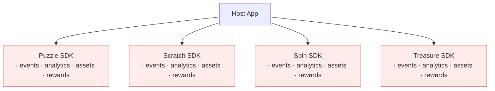
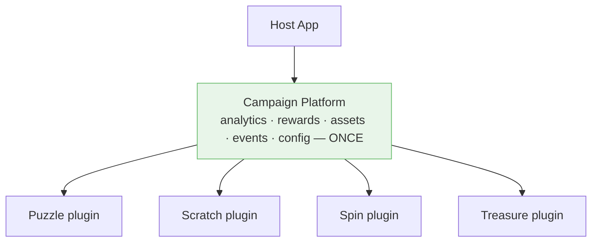
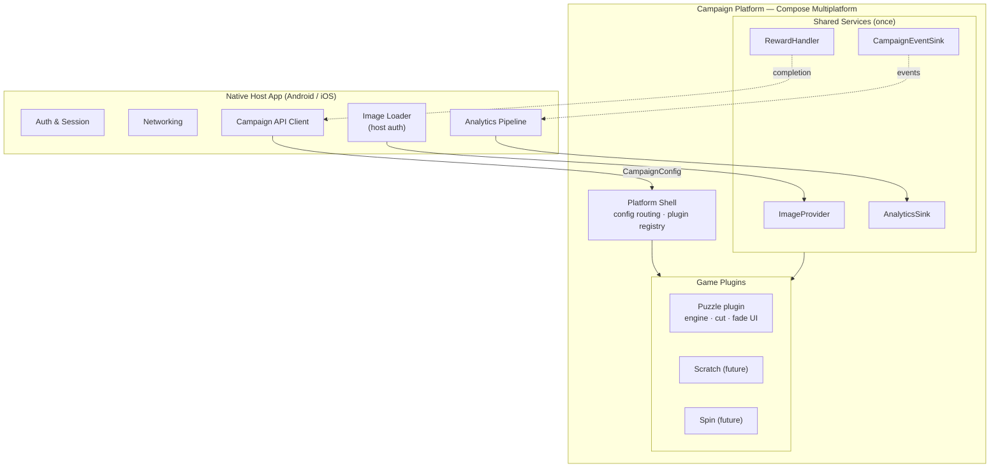
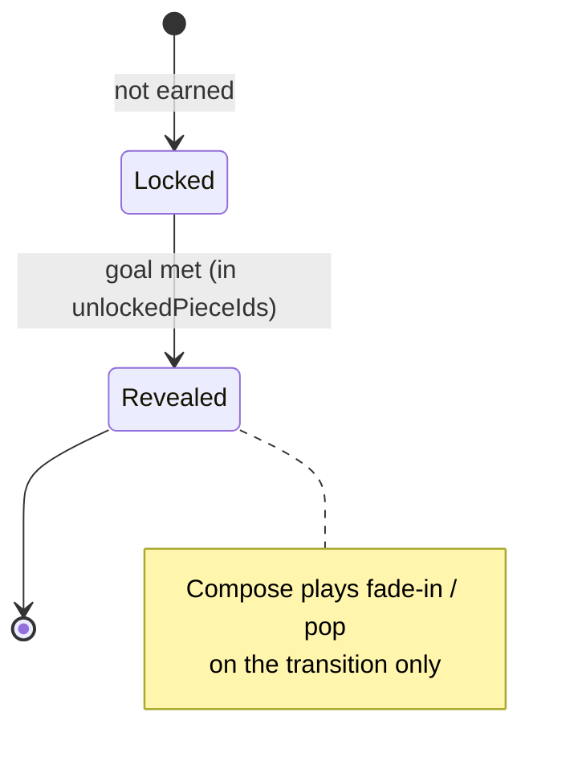

# Puzzle / Campaign Feature — Master Decision & Design Document

> The single source of truth for this feature. Two parts:
>
> - **Part I — The Decision Framework.** Three *independent* decisions → 12 combinations, scored, with a clear winner.
> - **Part II — The Recommended Build.** Full design for the winning combination (Campaign Platform + CMP + Fade), self-contained.

---

# PART I — THE DECISION FRAMEWORK

There are **three independent decisions**, not one. Tangling them is what makes this feel hard. Decide each on its own axis:

| # | Decision | Options | Decided on grounds of |
|---|---|---|---|
| **1** | **Platform Architecture** | Puzzle SDK · Campaign Platform | Long-term product strategy |
| **2** | **Technology** | CMP · KMP + Native · Fully Native | Team skills & reuse |
| **3** | **Mechanic** | Fade (Collect & Reveal) · Drag & Drop | Product engagement vs cost |

`2 × 3 × 2 = 12` combinations. The full scored matrix is at the end of Part I.

---

## Layer 1 — Platform Architecture: Puzzle SDK vs Campaign Platform

This is the **most important decision**, because it's the hardest to reverse and it compounds over time.

| Item | Puzzle SDK | Campaign Platform |
|---|---|---|
| Initial cost | Lower | Higher |
| Time to market | Faster | Slower |
| Reusability | Low | High |
| Supports future games | No | Yes |
| Maintenance | Easier *now* | Easier *later* |
| Scalability | Weak | Strong |
| Long-term ROI | Medium | Very high |

### What "Puzzle SDK" becomes after a year

A single-purpose SDK works fine on day one. But a Telco runs *campaigns* — so next quarter it's a scratch card, then a spin wheel, then a treasure hunt. Each one ships as its own SDK, and each re-implements the same plumbing:



Four copies of analytics, reward handling, asset loading, and event wiring. Every cross-cutting change happens four times. **This is the trap.**

### What "Campaign Platform" becomes after a year

One platform owns the cross-cutting concerns; each game is a thin plugin that just renders and emits semantic events:



Analytics, rewards, events, and assets are implemented **once** and reused by every game. Adding a game = adding a plugin.

### Verdict — Layer 1

- **If the feature will live < 1 year / is a one-off experiment → Puzzle SDK.** Don't over-build.
- **If this is a real Telco that will run recurring campaigns → Campaign Platform.** It wins easily on long-term ROI; the higher initial cost is paid back by the second game.

---

## Layer 2 — Technology: CMP vs KMP + Native vs Native

### Option A — Full CMP (shared logic **+** shared UI)

| Pros | Cons |
|---|---|
| ✅ UI written once | ❌ Compose runtime on iOS (+~9 MB binary) |
| ✅ Logic written once | ❌ iOS team must adopt Compose |
| ✅ Animations once | ❌ Debugging Compose-on-iOS is less familiar |
| ✅ Gestures once | ❌ Tied to JetBrains' CMP release cadence |
| ✅ Fastest to add features | |
| ✅ Perfect cross-platform parity | |

**Cost:** Initial = Medium · Future = **Very Low**

### Option B — KMP Logic + Native UI (Compose Android / SwiftUI iOS)

| Pros | Cons |
|---|---|
| ✅ Fully native feel | ❌ UI written **twice** |
| ✅ iOS team stays in SwiftUI | ❌ Animations written twice |
| ✅ Smaller iOS binary | ❌ Gestures written twice |
| | ❌ Visual drift between platforms |

**Cost:** Initial = Medium · Future = **Medium**

### Option C — Fully Native (nothing shared)

| Pros | Cons |
|---|---|
| ✅ No KMP / no CMP | ❌ Everything duplicated (logic *and* UI) |
| ✅ Teams fully independent | ❌ Highest maintenance |
| | ❌ Highest bug risk |
| | ❌ Highest parity risk |

**Cost:** Initial = **High** · Future = **High**

### Winner by feature complexity

| Feature size | Example | Winner |
|---|---|---|
| **Small** | Fade puzzle (isolated, one-off) | KMP + Native *(ties with CMP)* |
| **Medium** | Drag puzzle | **CMP** |
| **Large** | Games platform | **CMP** |

> **Reconciling the small case:** for a *single, isolated* fade feature, KMP + Native and CMP are roughly tied — the UI is so trivial that writing it twice barely hurts. But the moment you adopt the **Campaign Platform** vision (Layer 1), CMP pulls decisively ahead: shared UI components, theming, animations, and the plugin shell are reused across *every* game, so "write the UI once" compounds. **CMP's value rises with both feature complexity and the number of games.**

---

## Layer 3 — Mechanic: Fade vs Drag

| Dimension | Fade (Collect & Reveal) | Drag & Drop |
|---|---|---|
| UX flow | Unlock → Reveal → Reward | Unlock → Drag → Snap → Celebrate → Reward |
| Development | Easy | Hard |
| Accessibility | **Excellent** (no gestures) | Needs a tap fallback |
| Retention | **90–95%** of drag's | 100% (baseline) |
| Relative cost | **1×** | 3× (5× with custom jigsaw shapes) |

### Effort multipliers

| Mechanic | Effort |
|---|---|
| Fade | 1× |
| Drag | 3× |
| Drag + custom jigsaw shapes | 5× |

### Future-expansion impact

- **Fade** → adding Scratch / Spin / Treasure later is **easy** (same passive reveal-style patterns, shared infra).
- **Drag** → drags in physics, collision, hit-testing, and Canvas work that each new game may need to re-solve — **much harder** to generalize.

### Verdict — Layer 3

Fade delivers **90–95% of the retention for ~⅓ of the cost**. Start with Fade; add Drag as a v2 upgrade only if the product specifically wants the tactile "wow."

---

## The Final Matrix — all 12 combinations scored

Sorted best → worst.

| # | Architecture | Tech | Mechanic | Score |
|---|---|---|---|---|
| 1 | **Campaign Platform** | **CMP** | **Fade** | **10 / 10** ✅ |
| 2 | Campaign Platform | CMP | Drag | 9.5 / 10 |
| 3 | Campaign Platform | KMP + Native | Fade | 9 / 10 |
| 4 | Campaign Platform | KMP + Native | Drag | 8 / 10 |
| 5 | Puzzle SDK | CMP | Fade | 8 / 10 |
| 6 | Puzzle SDK | KMP + Native | Fade | 8 / 10 |
| 7 | Campaign Platform | Native | Fade | 7 / 10 |
| 8 | Puzzle SDK | CMP | Drag | 7 / 10 |
| 9 | Puzzle SDK | Native | Fade | 6 / 10 |
| 10 | Puzzle SDK | KMP + Native | Drag | 6 / 10 |
| 11 | Campaign Platform | Native | Drag | 5 / 10 |
| 12 | Puzzle SDK | Native | Drag | 4 / 10 |

### Recommendations — "if I were you"

| Goal | Pick | Estimate |
|---|---|---|
| **Fast MVP** | Campaign Platform + CMP + **Fade** | ~5–7 days *(puzzle plugin)* + platform foundation |
| **Marketing insists on a real puzzle** | Campaign Platform + CMP + **Drag** | ~10–14 days |
| **Never build this** ⛔ | KMP Logic + Native UI + **Drag** | — |

> **Why never KMP+Native+Drag:** you'd write the **hardest part of the whole project twice** — gestures, hit-testing, snap logic, and animation. That's exactly where CMP delivers its biggest saving, so going native there is the worst possible trade.

---

# PART II — THE RECOMMENDED BUILD

**Campaign Platform + CMP + Fade.** Everything below is the build design for that winner, self-contained.

## 1. Architecture — Campaign Platform with game plugins

The platform owns cross-cutting concerns; each game is a plugin. The component stays **dumb**: config in, events out. Auth, networking, and analytics live in the host and are exposed to games as injected services.



### Plugin contract

```kotlin
enum class GameType { PUZZLE, SCRATCH, SPIN, TREASURE }

// Cross-cutting capabilities the platform injects into every game
interface CampaignServices {
    val images: ImageProvider          // host-auth'd image loading
    val analytics: AnalyticsSink       // shared tracking
    val rewards: RewardHandler         // shared reward/claim flow
    val events: CampaignEventSink      // semantic events out
}

// Every game is a thin plugin
interface CampaignGame {
    val type: GameType
    @Composable
    fun Content(config: CampaignConfig, services: CampaignServices)
}
```

The shell reads a `CampaignConfig`, looks up the plugin whose `type` matches, and renders it with shared services injected. Adding a new game = registering a new `CampaignGame`. Analytics, rewards, assets, and events are reused untouched.

### The Puzzle plugin

```kotlin
class PuzzleGame : CampaignGame {
    override val type = GameType.PUZZLE

    @Composable
    override fun Content(config: CampaignConfig, services: CampaignServices) {
        val image = services.images.rememberImage(config.imageRef)
        PuzzleCampaignScreen(
            config = config.toPuzzleConfig(),
            image = image,
            onEvent = { services.events.emit(it) }   // platform routes to analytics/rewards
        )
    }
}
```

---

## 2. The Puzzle contract (config in / events out)

```kotlin
data class PuzzleConfig(
    val campaignId: String,
    val grid: GridSpec,                  // rows x cols
    val progress: PuzzleProgress,        // which pieces are unlocked (= revealed)
    val reward: RewardDisplay? = null,
    val edgeSeed: Long = campaignId.hashCode().toLong(),
    val revealStyle: RevealStyle = RevealStyle.FADE
)

data class GridSpec(val rows: Int, val cols: Int) { val totalPieces get() = rows * cols }
data class PuzzleProgress(val unlockedPieceIds: Set<Int>)
enum class RevealStyle { FADE, FADE_AND_POP }
data class RewardDisplay(val label: String, val ctaText: String = "Claim")

sealed interface PuzzleEvent {
    data class PieceRevealed(val pieceId: Int) : PuzzleEvent
    data class ProgressChanged(val revealed: Int, val total: Int) : PuzzleEvent
    data object PuzzleCompleted : PuzzleEvent
    data class RewardTapped(val campaignId: String) : PuzzleEvent
}
```

The revealed set **is** the state — reveal is deterministic from `unlockedPieceIds`, nothing extra to persist.

---

## 3. The Reveal engine (plain Kotlin)

```kotlin
data class PuzzlePiece(
    val id: Int,
    val cell: GridCell,
    val edges: EdgeProfile,    // tab/blank/flat per side → cut shape
    val state: PieceState      // LOCKED or REVEALED
)
enum class PieceState { LOCKED, REVEALED }

fun update(newProgress: PuzzleProgress): RevealDelta {
    val newlyRevealed = newProgress.unlockedPieceIds - previous.unlockedPieceIds
    previous = newProgress
    val complete = newProgress.unlockedPieceIds.size == grid.totalPieces
    return RevealDelta(newlyRevealed, isComplete = complete)
}
```

The diff is the crux: the UI fades in **only** the newly earned piece; everything else renders instantly.



Board: `IN_PROGRESS → COMPLETED` when all pieces are `REVEALED`.

---

## 4. Procedural cut geometry (reusable across campaigns)

No pre-cut PNGs (which force Design to re-cut 16 images per campaign and blur across densities). Instead:

1. Each interior edge is randomly a `TAB`/`BLANK` pair, **seeded by `edgeSeed`** (stable per campaign). Borders are `FLAT`.
2. The engine derives each piece's `EdgeProfile` + cell rect.
3. Shared Compose turns an `EdgeProfile` into a `Path` (`FLAT` = line; `TAB`/`BLANK` = ~3 cubic béziers).
4. `Modifier.clip(pieceShape)` clips the campaign image into the piece.

Because it's one Compose code path, pieces are **identical on both platforms by construction** — zero parity work, crisp at any density, one source image per campaign. The same `Path` also draws the **ghost outline** of locked pieces.

---

## 5. Rendering & the "feels like building" UX

- **Locked** → faint ghost outline of the cut shape (+ optional dimmed image, lock badge) so the user sees the whole picture forming.
- **Revealed** → full-color clipped image, **faded in** (alpha 0→1, ~300–400 ms); `FADE_AND_POP` adds a 0.9→1.0 scale.
- **Newly revealed** → the only animating piece (driven by the engine diff).
- **Progress** → header bar (`X of N`) + the board itself.
- **Completion** → celebration pass + reward CTA.

All shared Compose: a grid of `Image` cells with `Modifier.clip` + `animateFloatAsState`. No gestures.

---

## 6. Backend contract (campaign-level)

```json
{
  "schemaVersion": 1,
  "campaignId": "summer2026",
  "gameType": "PUZZLE",
  "grid": { "rows": 4, "cols": 4 },
  "imageRef": "summer2026_main",
  "progress": { "unlockedPieceIds": [0, 1, 2, 3, 4, 5] },
  "reward": { "type": "data_bundle", "label": "10 GB", "ctaText": "Claim" }
}
```

Backend owns: `gameType`, unlocked pieces, total, reward, `imageRef`. Platform/plugin owns: cut, reveal, completion. The plugin emits `PuzzleCompleted`; the **host** records it via its own API. `schemaVersion` from day 1. `gameType` is what lets the platform route to the right plugin.

---

## 7. Image loading & auth

The component never fetches images (Telco CDNs are authenticated). The host resolves `imageRef` to an auth'd image and provides a decoded `ImageBitmap` (Compose's shared image type) through `ImageProvider`. Auth stays 100% in the host. Analytics: emit events; the platform routes them to the host pipeline — no second analytics SDK baked in.

---

## 8. Integration

**Android** — render the platform entry composable directly:

```kotlin
CampaignHost(config = campaignConfig, services = appCampaignServices)
```

**iOS** — expose a `ComposeUIViewController` factory from shared `iosMain` and wrap it in SwiftUI:

```kotlin
fun CampaignHostViewController(
    config: CampaignConfig,
    services: CampaignServices
): UIViewController = ComposeUIViewController { CampaignHost(config, services) }
```

```swift
struct CampaignHostView: UIViewControllerRepresentable {
    func makeUIViewController(context: Context) -> UIViewController {
        PlatformKt.CampaignHostViewController(config: config, services: services)
    }
    func updateUIViewController(_ vc: UIViewController, context: Context) {}
}
```

Boundary rule: plain callbacks, never `Flow`/`suspend`; `sealed interface` events become Swift classes checked with `is`.

---

## 9. Implementation plan

First delivery = **platform foundation + Puzzle plugin**. Subsequent games are far cheaper because the platform already exists.

```mermaid
gantt
    title Campaign Platform + CMP + Fade — first delivery (working days)
    dateFormat X
    axisFormat %s
    section Platform foundation (one-time)
    Plugin contract + shared services + config routing :0, 3
    section Puzzle logic
    Reveal engine + cut geometry + tests               :3, 5
    section Puzzle UI (CMP)
    Board · clip · fade · ghost state                  :5, 8
    section iOS embedding
    ComposeUIViewController + CI setup                  :8, 9
    section Polish & hardening
    Completion · reward CTA · backend · QA (both)       :9, 11
```



| Phase | Work | Days |
|---|---|---|
| **0 — Platform foundation** *(one-time)* | Plugin contract, shared services (images/analytics/rewards/events), config routing | 2–3 |
| **1 — Puzzle logic** | Reveal diff, procedural cut geometry, **unit tests** | 1.5–2 |
| **2 — Puzzle UI (CMP)** | Board, clip pieces, fade-in, ghost locked state — **written once** | 2–3 |
| **3 — iOS embedding** | `ComposeUIViewController` factory, SwiftUI wrapper, KMP build in CI | 0.5–1 |
| **4 — Polish & hardening** | Completion, reward CTA, backend integration, QA both platforms | 1–2 |
| | **First delivery total** | **≈ 7–11 days** |
| | *Each subsequent game (Scratch/Spin)* | *~3–5 days* |

> The puzzle *plugin itself* is ~5–7 days of that; the platform foundation adds the rest **once** and pays back on game #2.

---

## 10. Risks & open decisions

- **iOS binary size** (~9 MB Compose runtime). Confirm it fits the app budget.
- **One-time iOS/CMP CI setup.** Front-loaded, paid once.
- **Re-animation bug.** The engine diff must be correct or revealed pieces re-fade on every refresh — cover with a unit test.
- **Config schema evolution.** Versioned from day 1; `gameType` drives plugin routing.
- **Accessibility.** Fade is gesture-free and inherently accessible; add proper semantics for locked/revealed states.

---

## 11. Roadmap

- **v1:** Campaign Platform + Puzzle (Fade) plugin.
- **v1.x:** Scratch / Spin / Treasure plugins — cheap, reuse all shared services.
- **v2:** Drag-and-drop puzzle as an upgrade — **still pure CMP** (`detectDragGestures`, snap, tray, a `DRAGGING` state), so no framework switch.

---

### TL;DR

Three decisions, decided independently. The winner (**10/10**) is **Campaign Platform + CMP + Fade**: build a platform that hosts game plugins sharing analytics/rewards/assets/events once; build the puzzle UI once in Compose Multiplatform; ship the gesture-free fade mechanic that delivers 90–95% of drag's retention at ~⅓ the cost. First delivery (platform + fade puzzle) ≈ **7–11 days**; each later game ≈ 3–5 days; drag-and-drop available later as a pure-CMP v2. The one combination to avoid entirely is **KMP+Native+Drag** — it writes the hardest code twice.
