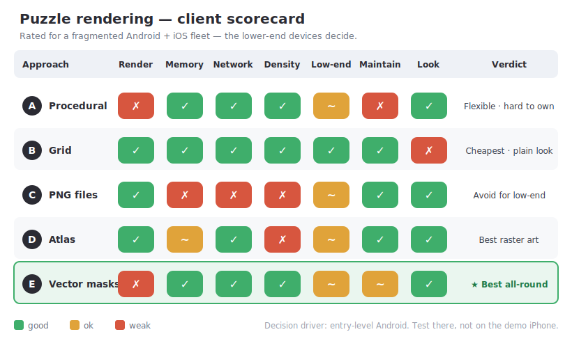

# Puzzle Rendering — Decision in One Page

**The decision:** how do we produce and draw the puzzle pieces so it looks good, runs everywhere, and
the team can maintain it?

**Why it's hard:** there's no free lunch — every option trades **render cost ↔ asset weight ↔
multi-device scaling ↔ maintainability**. A choice that's smooth on the demo iPhone can still be the
wrong one.

**The fleet truth:** most of our users are **entry-level Android** (≈2 GB RAM, weak GPU, slow data) —
not the flagship the app is built on. **They decide.**

## The five options, in a sentence

- **A — Procedural jigsaw (today):** shapes made by code, image clipped to each. Flexible & crisp on any screen, but **hard to maintain** and the heaviest to render.
- **B — Grid:** image sliced into rectangles. Cheapest and bulletproof everywhere — but **looks plain**.
- **C — Backend PNGs (one file per piece):** full art control, dumb client — but **N downloads + big memory + blurry on tablets**. Worst fit for entry Android.
- **D — Backend PNGs (one atlas):** like C but one packed image — better bandwidth; still raster (density variants, GPU texture-size limit).
- **E — Backend vector shapes + one image:** backend owns the look, asset stays ~300 KB and **crisp on every screen**; client just clips. Only cost: the same render as A (and it's fixable).

## Recommendation

> **Default to E (vector masks)** — maintainable, backend-controlled, light, and sharp from a 5″ phone
> to a 13″ tablet. Use **B (grid)** if a plain look is acceptable, and **D (atlas)** only when
> photo-real raster pieces (bevels/textures) are non-negotiable. **Avoid C** for our device mix.

**If users keep uploading their own photos / any piece count:** this points even harder to **E** — its
backend computes only lightweight *polygons* per image, whereas C/D must render and host raster pieces
for every photo and every screen density.

## Next step

Pick a lane (**B**, **D**, or **E**), confirm whether **user photos** stay a requirement, then we
produce the exact backend contract + the slim list of client files to add/change/delete — and only
then implement.

---

*Full detail:* [client-rendering-comparison.md](client-rendering-comparison.md) (efficiency, memory/GPU
math, multi-device deep dive, per-device budgets, mitigations, traps) ·
[engineering-guide.md](engineering-guide.md) · [algorithms-and-rendering.md](algorithms-and-rendering.md)
